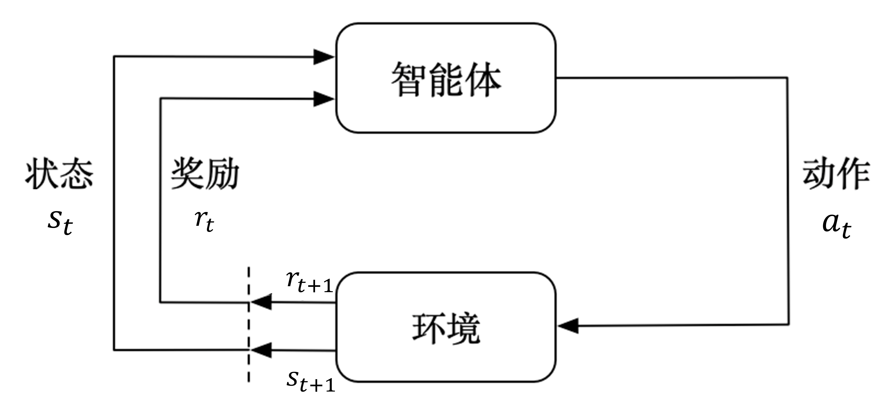

# 马尔可夫决策过程

马尔可夫决策过程 (Markov Decision Process, MDP) 是强化学习中的基本问题模型之一.
- 目的是以数学形式来描述 Agent(智能体) 与 environment(环境)交互 中完成目标学习的过程. 即, 用数学形式表述一个学习过层.

智能体与环境交互的马尔可夫决策过程过程如下图所示:

- 图中 t 表示 time step, $t = 1, 2, 3,...$
  > t 与现实时间并不是一一对应的关系, 它描述的是 Agent 进行交互并获得反馈所需要的时间.
- 每个 time step 中, Agent 从 Environment 中观察到一个 state(状态) $s_t$, 并根据当前状态 $s_t$ 和当前奖励 $r_{t}$ 选择并执行一个动作 Action $a_t$.

- 执行动作 $a_t$ 后, Agent 会得到一个 reward(奖励) $r_{t+1}$, 在执行动作 $a_t$ 的过程中, Environment 也会受到影响并进入到下一个状态 $s_{t+1}$.
    > - 我们将$a_t$的奖励记为 $r_{t+1}$ 而不是 $r_t$ 是为了强调获得奖励的时候 time step 已经更新到 t+1 了
    > - Agent 得到的奖励 $r_t$ 在实际情况中可能是一个**随机变量或函数** 而不是一个定值, 有些书籍会将它记为 $R_t$, 这里为了便于概率论相关公式的推导, 暂时用 $r_t$.

此时, 根据这个图, 我们会记录到一系列轨迹:
$$
s_0, a_0, r_1, s_1, a_1, r_2, ..., s_t, a_t, r_{t+1}, ...
$$

我这里只探讨有限马尔可夫决策过程 (Finite MDP), 因此 t 是有限的, 上限为 T.
- 通常, $[0, T]$ 这个时间范围被称为一个 `episode`(回合). 例如游戏中的一局.
  - T 也是最后一个 time step.


---

## 马尔可夫性质
马尔科夫性质指的是: `当前时刻的状态 只由 前一个时刻状态决定, 与 更早的历史状态 无关`. 用公式表达为:

$$
P(s_{t+1} | s_t, s_{t-1}, ..., s_0) = P(s_{t+1} | s_t)
$$

对于马尔可夫性质:
- **允许**我们在没有考虑完整的历史经历的情况下, 近依靠最近的一次状态进行预测和控制 Agent 的行为.
- 实际问题中有很多**不满足**马尔科夫性质的例子, 比如棋类游戏, 它需要考虑当前状态以及所有历史状态.
    - 此时我们可以用深度学习神经网络来表示当前的棋局，并用`蒙特卡洛搜索树`等技术来模拟玩家的策略和未来可能的状态，来构建一个新的决策模型，这就是著名的 [AlphaGo](https://www.nature.com/articles/nature16961) 算法.


--- 

## 回报 (Return)
最开始我们有提到, 有限马尔可夫决策过程的实现目标是在有限的 time step 前提下`让 Agent 的累积奖励最大化`. 这里为了描述方便, 将**累积奖励**记为`回报 (Return)`, 用 $G_t$ 表示, 写成数学公式如下:
$$
G_t = r_{t+1} + r_{t+2} + ... + r_T
$$
- 此公式仅适用于 `T为有限值` 的场景, 比如玩游戏时, 我们总是在某个步数 (即T) 后以特殊的状态结束游戏.

对于**无限马尔可夫决策过程**, 我们需要引入一个折扣因子 $\gamma$ 来调整回报的计算方式:
$$
G_t = r_{t+1} + \gamma r_{t+2} + \gamma^2 r_{t+3} + ... = \sum_{k=0}^{\infty} \gamma^k r_{t+k+1}
$$
- 其中, $\gamma$ 是一个介于 0 和 1 之间的值, 用来调整未来奖励的重要性.
  - 当 $\gamma = 0$ 时, Agent **只关注当前的奖励**, 不考虑未来奖励.
  - 当 $\gamma = 1$ 时, Agent 会**着重考虑所有未来奖励**.

引入 $\gamma$ 还可以将当前 time step 的回报与未来 time step 的回报进行关联, 从而更好地指导 Agent 的行为. 也就是说, 我们可以获得下面的递推式:

$$
\begin{aligned}
G_t &= r_{t+1} + \gamma r_{t+2} + \gamma^2 r_{t+3} + \ldots \\
    &= r_{t+1} + \gamma (r_{t+2} + \gamma r_{t+3} + \ldots) \\
    &= r_{t+1} + \gamma G_{t+1}
\end{aligned}
$$

这个公式对于所有 $t<T$ 都成立, 并且在 **贝尔曼公式** 中这个推导式尤其重要.

---

# 状态转移矩阵

根据状态是否有限(T是否为有限值), 我们可以将马尔科夫过程的状态转移矩阵的建模分成两种情况:
- 无限状态马尔可夫决策过程 (Infinite MDP)
  - 这个过程又被称为**连续时间马尔可夫决策过程** (Continuous Time MDP), 它允许发生无限次事件，每个事件发生的机会相对较小，但当时间趋近于无穷大时，这些事件以极快的速度发生.
  - 需要使用泊松过程(Poison Process)等方法来描述状态转移概率.
  - 
- 有限状态马尔可夫决策过程 (Finite MDP), 我们下面主要探讨的场景.


## 马尔可夫链 (Markov Chain)
下面这张图就是一个马尔可夫链的例子, 它同时也可以用来描述马尔可夫决策过程的**状态流向**:

- 马尔可夫链 也称为 **离散时间的马尔可夫过程（Markov Process）**，跟马尔可夫决策过程一样，都需要满足马尔可夫性质。即当前时刻的状态只与前一个时刻的状态有关，与更早的历史状态无关.

- 图片中线旁边标注的数字称为 **状态转移概率** (state transition probability), 表示从一个状态转移到另一个状态的概率.
  - 从图中寻找移概率的时候, 我们需要确保 "转入概率" 与 "转出概率" 之和为 1. 
    - 例如 $s_1 → s_1$ 为 0.2, 那么从 $s_1$ 转移出去的概率之和就要为 0.8, 因此可以确定 $s_1 → s_2$ 为 0.4, $s_1 → s_3$ 为 0.4.

- 图中**有箭头的线**表示状态之间转换是有方向的, 线上数字表示的转移概率, 比如从 $s_1$ 转移回到状态 $s_1$ 的概率是 0.2

- 图中**无箭头的线**表示状态之间转换是双向的, 线上数字表示的转移概率(一般), 比如 $s_1$ 和 $s_2$ 之间的转移概率是 0.3


用公式表示状态转移概率为:
$$
P_{ss'} = P(s_{t+1} = s' | s_t = s)
$$
- 从当前状态 $s$ 转移到下一个状态 $s'$ 的概率. $S$ 是状态空间, 包含了所有状态, 即$s, s' \in S$.

由于状态的数量是有限的, 我们可以将这些状态以及转移概率写入一个表格中:

<div align="center">

| state | $s_1$ | $s_2$ | $s_3$ |
| --- | --- | --- | --- | 
| $s_1$ | 0.2 | 0.4 | 0.4 |
| $s_2$ | 0.2 | 0.5 | 0.3 | 
| $s_3$ | 0.1 | 0.3 | 0.6 |

</div>

用矩阵表示的话, 得到:
$$
P_{ss'} = 
\begin{bmatrix}
0.2 & 0.4 & 0.4 \\
0.2 & 0.5 & 0.3 \\
0.1 & 0.3 & 0.6
\end{bmatrix}
$$

如果用符号表示, 则有:
$$
P = \begin{pmatrix}
P_{11} & P_{12} & \cdots  & P_{1n}  \\
P_{21} & P_{22} & \cdots  & P_{2n}  \\
\vdots & \vdots & \ddots  & \vdots  \\
P_{n1} & P_{n2} & \cdots  & P_{nn}
\end{pmatrix}
$$
- 其中, $P_{ij}$ 表示从状态 $s_i$ 转移到状态 $s_j$ 的概率.
- 注意, 同一状态所有转台转移概率加起来应等于 1. 也就是每一行加起来应该等于1.

---

现在回到我们这里讨论的强化学习, 首先需要重新强调强化学习中的一些概念:
```txt
环境: 除了智能体以外, 所有与智能体交互的对象都被称为环境.

状态: 指的是 "环境" 的状态

动作: 指的是 "智能体" 的动作, 动作会影响 "环境" 并产生的 "状态"
```
- 当我们指定了某个东西为 "智能体" 后, 它就会成为我们关注的对象, 而其他的东西就会被称为 "环境".
  - 在强化学习中, **毕竟交互是相互的，强化学习中的环境也不是严格意义上的静止环境，它也可以是其他智能体**。
  - **有时 智能体 和 环境 的角色是能相互对调的，只要能各自建模成马尔可夫决策过程即可**

---

明确概念之后, 就需要强调一下:
- **状态转移矩阵属于环境的一部分**, 跟智能体是没什么关系的，而智能体会根据状态转移矩阵来做出决策。
- 在 **马尔可夫链(马尔可夫过程)** 的基础上增加 **奖励元素** 就会形成`马尔可夫奖励过程（Markov reward process, MRP）`
- 在 **马尔可夫奖励过程** 基础上增加 **动作的元素** 就会形成`马尔可夫决策过程`，也就是强化学习的基本问题模型之一.

马尔可夫链 和 马尔可夫奖励过程 在其他领域 例如金融分析 会用的比较多，**强化学习则重在决策**。


在强化学习中, 我们习惯使用一个 五元组 $<S, A, R, P, \gamma>$ 来表示一个 马尔可夫决策过程.
- 其中 $S$ 表示状态空间，即所有状态的集合，$A$ 表示动作空间，$R$ 表示奖励函数，$P$ 表示状态转移矩阵，$\gamma$ 表示折扣因子。


# 练习题
1. 强化学习所解决的问题一定要严格满足马尔可夫性质吗？请举例说明。
```txt
强化学习所解决的问题并不需要严格满足马尔可夫性质, 例如棋类游戏, 它需要考虑所有历史状态, 这并不符合马尔可夫性质, 而且我们已经有强化学习的代表作 AlphaGo, 它就是一个典型的强化学习例子.
```

2. 马尔可夫决策过程主要包含哪些要素？
```txt
一共包含5大要素:
1. 状态集合 S
2. 动作集合 A
3. 奖励函数 R
4. 状态转移矩阵 P
5. 折扣因子 γ
```

3. 马尔可夫决策过程与金融科学中的马尔可夫链有什么区别与联系？
```txt
区别:
    马尔科夫链是一个描述状态之间转移概率的模型, 它只包含状态转移概率, 而马尔可夫决策过程还包含了奖励函数和折扣因子.

联系:
    马尔可夫决策过程是马尔可夫链的一个扩展, 它在马尔可夫链的基础上增加了奖励函数和折扣因子, 用来描述智能体与环境交互的过程.
```
