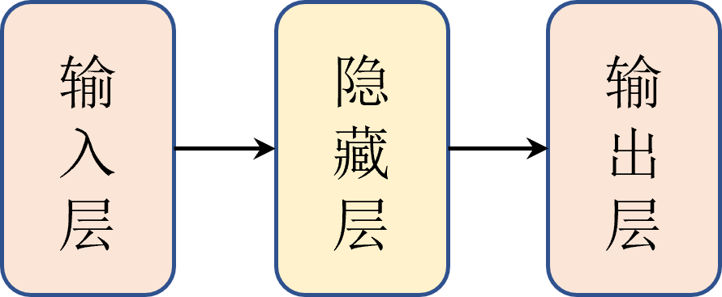
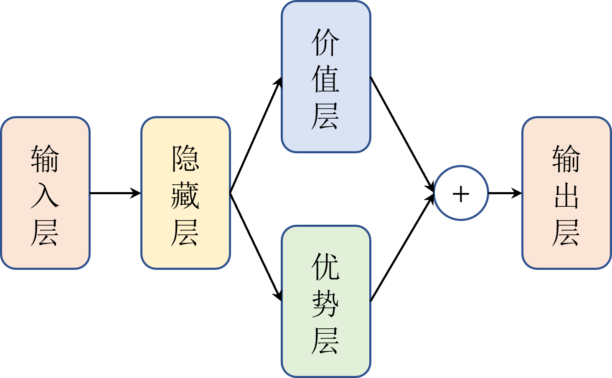
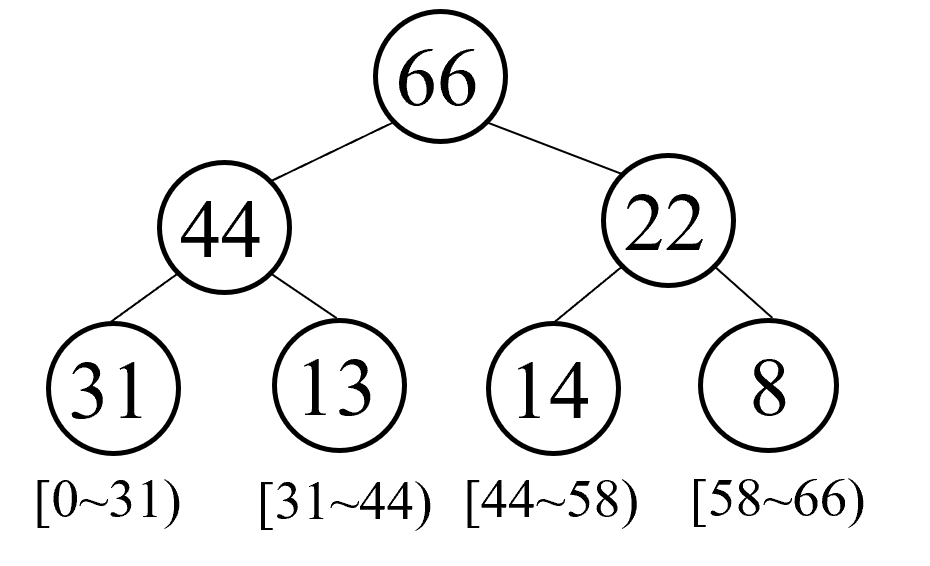

# Overview
这里主要提到一些 DQN 的改进算法, 包括 Double DQN, Dueling DQN, Noisy DQN, PER DQN算法等. 他们的改进主要目的还是通过**提高预测的精度和控制过程中的探索度**来改善DQN的性能. 主要改进方向有:
- 改进网络模型
- 改进经验回放

# Double DQN 算法
Double DQN 算法是目前较为成熟的 Nature DQN 算法, 它的主要贡献在于引入了两个网络来解决Q值过估计(overestimation)的问题. 为了避免与 DQN 中提到的 "目标网络" 混淆, 这里简单梳理一下发表历史:
- 2013年 DQN 发表, 它只是在 Q-learning 基础上引入了神经网络而已, 没有其他额外的技巧
- 在2013~2015年间, Double DQN 算法被提出, 然后 DeepMind 公司在 2015年借鉴了 Double DQN, 在 nature 上发表了新的DQN算法, 称为 Nature DQN.

因为 Double DQN 这个改进网络比较经典, 所以单独拿出来讲讲.

## Q值过估计
首先回顾一下DQN的公式:
$$
Q_{\theta}(s_t, a_t) \leftarrow Q_{\theta}(s_t, a_t) + \alpha \left[ r_t + \gamma \max_a Q_{\hat{\theta}}(s_{t+1}, a) - Q_{\theta}(s_t, a_t) \right]
$$
- 其中 $y_t = r_t + \gamma \max_a Q_{\hat{\theta}}(s_{t+1}, a)$ 表示Q的估计值, $\hat{\theta}$ 表示**目标网络**的参数.
- 由于这里直接拿目标网络中各个动作对应的**最大的 Q 值来当作估计值**，这样一来**就会存在过估计的问题**。

Double DQN 为了处理这个Q值过估计问题, 使用方法是:
```txt
现在"当前网络"中找出最大 Q 值对应的动作，然后再将这个动作代入到"目标网络"中去计算 Q 值.
```
即:
1. 先用 "当前网络" (每处理一个样本就更新一下参数) 找出最大 Q 值所对应的 动作$\alpha$
$$
\alpha^{max}_{\theta}(s_{t+1}) = \arg \max_a Q_{\theta}(s_{t+1}, a)
$$
2. 将这个 动作 代入到 "目标网络" (更新没那么频繁的网络, 并且是用于计算 $y_i$ 的那个网络) 中计算目标的 Q 值, 从而得到 估值$y_i$.
$$
y_t = r_t + \gamma \max_a Q_{\hat{\theta}}(s_{t+1}, \alpha^{max}_{\theta}(s_{t+1}))
$$

这个过程相当于把 动作选择 和 动作评估 分离, 从而减轻了过估计问题.
- 动作选择的过程相当于 去收集情报, 
- 动作评估则是 进行一定程度的筛选, 最后"上报"给模型的是相对优质的结果, 此时模型参数的更新会显得更有意义.

相比 Nature DQN, 它没有经过筛选的过程, 而是直接直接"上报", 不管三七二十一直接更新参数.

对于训练过程:
- DQN (或者说 Nature DQN) 是每隔 C 次迭代就复制一次"当前网络"的参数给"目标网络"
- 而 Double DQN 则是每次迭代都会随机从这两个网络中选一个进行更新
  - 这时候, "目标网络" 和 "当前网络" 的就不是那么固定了, 参数被更新的那个网络会充当"当前网络", 而另一个没有更新参数的网络就是"目标网络", 它负责计算 $y_t$.

由于 Nature DQN 那种直接复制参数的方便简单粗暴, 容易实现, 所以一般都采用这种直接复制的办法.

---

# Dueling DQN 算法
这个算法主要针对神经网络的结构进行优化.
在DQN中, 它的网络很简单, 就一个 MLP:


在 Dueling DQN 中, 它只是用了两个分支而已:

- 优势层(advanture layer): 估计每个动作带来的优势
- 价值层(Value layer): 估计每个状态的价值, 输出维度是1

用公式表示为:
$$
Q_{\theta, \alpha, \beta}(s,a) = (A_{\theta,\alpha}(s,a) - \frac{1}{|A|} \sum_{a \in \Alpha} A_{\theta,\alpha}(s,a)) + V_{\theta,\beta}(s) 
$$
- 其中 $A_{\theta,\alpha}(s,a)$ 表示优势层, $\theta$表示共享的隐藏层参数, $\alpha$ 表示优势层自己这部分参数
- 相应地, $V_{\theta,\beta}(s)$ 表示价值层, $\theta$表示共享的隐藏层参数, $\beta$ 表示价值层自己这部分参数

后面的章节中会提到一个很相似的网络, 叫 Actor-Critic 网络, 它也是有两个分支结构, 优势层相当于 actor, 价值层相当于 critic. 不一样的是, Actor和Critic是分开的两个独立网络, 而 Dueling DQN 是在一个网络中实现的.
- 这种分支结构有助于隔离每个网络输出上的影响，并且只更新适当的子网络，这有助于**降低方差并提高学习鲁棒性**。

---

# Noisy DQN 算法
这个网络也是改进网络结构, 不过它的目标不是提高Q值的估计, 而是增强网络的探索能力.

Noisy DQN 网络在 DQN 的基础上引入了噪声层, 即将随机性应用到网络参数中, 增加了网络对状态和动作空间探索的能力. 从而提高收敛速度和稳定性. 
- 实现的时候就简单地给线性层加上噪声即可.

注:
- 给网络权重加噪声在强化学习中是一个很常用的trick.


---

# PER (Prioritized experience replay) DQN 算法
PER (Prioritized experience replay, 优先经验回放) DQN 是对经验回放的改进, 它在采样过程中**赋予经验回放中样本的优先级**.
- 优先级的赋予依据是 Time Different (TD, 时序差分). 
  - 我们每次从经验回访中取出一个批量的样本，进而计算的 TD 误差一般是不同的，对于 DQN 网络反向传播的作用也是不同的。TD误差越大，损失函数的值也越大，对于反向传播的作用也就越大。 这样一来如果 TD 误差较大的样本更容易被采到的话，那么我们的算法也会更加容易收敛。因此我们只需要设计一个经验回放，根据经验回放中的每个样本计算出的TD误差赋予对应的优先级，然后在采样的时候取出优先级较大的样本。

实现的时候则是借助 SumTree 这样的二叉树结构来实现:

- 最底层是样本和对应的优先级, 图中每个节点的值就是他们的 TD error.
- 并且根据叶子节点的值，我们从 0 开始依次划分采样区间。然后在采样中，例如这里根节点值为 66 ，那么我们就可以在 [0,66) 这个区间均匀采样，采样到的值落在哪个区间中，就说明对应的样本就是我们要采样的样本。例如我们采样到了 25 这个值，即对应区间 [0,31)，那么我们就采样到了第一个叶子节点对应的样本。
- 第一个样本对应的区间也是最长的，这意味着第一个样本的优先级最高，也就是 TD 误差最大，反之第四个样本的区间最短，优先级也最低。这样一来，我们就可以通过采样来实现优先经验回放的功能。


在实现时, 考虑效率因素, 每次更新 SumTree 的时候并不会把经验回放中的所有样本都计算 TD error 和 相应的优先级. 而是只更新当前取到的小批量样本, 此时, 每次计算 TD error 对应的其实是之前的网络, 而非当前 time step 下的网络.
- 这时候, 又引入了新问题:
  1. 如果某批量样本的 TD 误差较低，只能说明它们对于之前的网络来说“信息量”不大，但不能说明对当前的网络“信息量”不大，因此单纯根据 TD 误差进行优先采样有可能会错过对当前网络“信息量”更大的样本。
  2. 其次，被选中样本的 TD 误差会在当前更新后下降，然后优先级会排到后面去，下次这些样本就不会被选中，这样来来回回都是那几个样本，很容易出现“旱的旱死，涝的涝死”的情况，导致过拟合。

解决方案是引入随机优先级采样(stochastic prioritization)和重要性采样(importance sampling)的方法:

To be continued....
