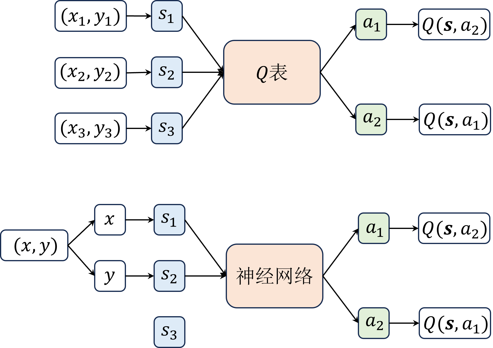
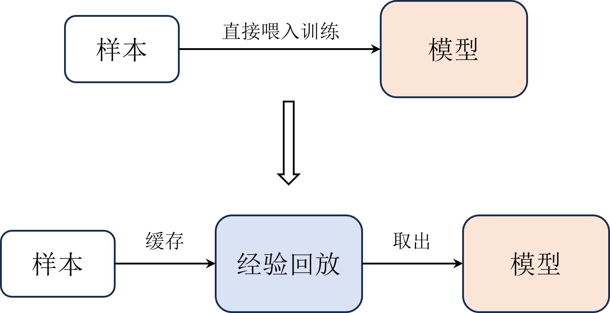
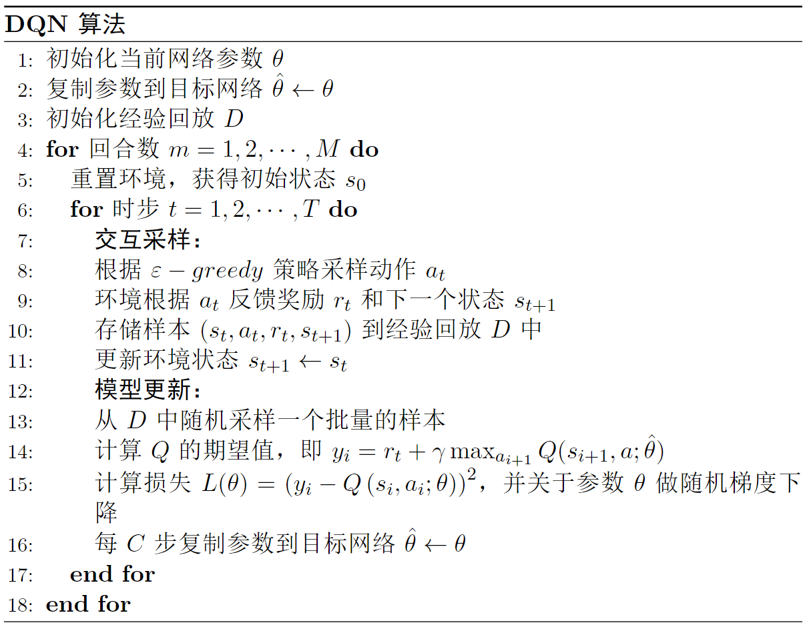
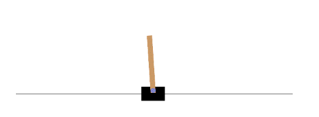

# DQN (Deep Q-Network)
DQN网络主要贡献是在 Q-learning 的基础上引入了`深度神经网络来近似动作价值函数`$Q(s,a)$, 从而实现对高维状态空间的处理.
- Q-learning 是一种基于值的强化学习算法, 它的目标是学习一个最优的**动作价值函数**$Q(s,a)$, 使得在状态$s$下, 选择动作$a$可以获得最大的累积奖励.

DQN算法主要由 DeepMind 在[2013](https://arxiv.org/abs/1312.5602)和[2015](https://www.nature.com/articles/nature14236)年的两篇文章实现. 这里主要关注2015年那篇文章.
- DQN除了使用神经网络替代Q函数之外, 还引入了`经验回放`和`目标网络`等技巧.


---

## Q-table 与 DQN
Q-table(Q表)一般用在`数量有限并且为离散的state`的场景下, 它是一个**二维表格**, 行表示状态, 列表示动作, 每个元素表示在某个状态下选择某个动作的价值.

DQN一般用在`状态空间较大且连续`的场景下, 它是一个神经网络, 输入是状态$s$, 输出是每个动作$a$的**价值**$Q(s,a)$.
- 不仅如此, 因为是一个神经网络, 这里也会多出需要学习的模型参数.

如下图所示:


以走迷宫为例，把迷宫的每个位置当作一个状态，用坐标来表示的话，Q-table里的数据就是:
 $s_1 = (x_1,y_1) = (0,0)$, $s_2 = (x_2,y_2) = (1,1)$

而在DQN中, 它的输入可以是连续的值，因此只需要把每个维度的坐标看作一个输入，就可以处理高维的状态空间了。
- 神经网络只用了两个维度的输入就表示了原来 Q-table 中无穷多个状态.

故, 用 Q-table 描述状态空间时, 一般用的是`状态个数`; 而在 DQN 中, 状态个数是无穷的, 一般用`状态维度`进行描述.

---

## Q-learning 与 DQN 的更新公式
Q-learning 的更新公式是:
$$
Q(s_t,a_t) \leftarrow Q(s_t,a_t) + \alpha \left[ r_{t+1} + \gamma \max_a Q(s_{t+1},a) - Q(s_t,a_t) \right]
$$
- 对于上式, 我们一般将 $r_{t+1} + \gamma \max_a Q(s_{t+1},a)$ 视为 $y_t$, 表示我们所期望得到的Q值; 
- $\left[ r_{t+1} + \gamma \max_a Q(s_{t+1},a) - Q(s_t,a_t) \right]$ 相当于计算了loss; 
- $\alpha$ 对应的是学习率.
- 由于整个过程没有超参数, 因此可以直接进行迭代学习Q值.
- 值得说明的是: 箭头的左侧表示更新后的Q值, 右侧表示更新前的Q值.
  - 右侧的 $Q(s_t, a_t)$ 表示 Q-table 里还没被更新的Q值, 而左侧的 $Q(s_t, a_t)$ 表示更新后的Q值.

在 DQN 中, 我们引入了模型参数 $\theta$, 所以式子写为:
$$
Q(s_t,a_t;\theta) \leftarrow Q(s_t,a_t;\theta) + \alpha \left[ y_t - Q(s_t,a_t;\theta) \right]
$$
- 式中$y_i = r_{t+1} + \gamma \max_a Q(s_{t+1},a;\theta)$, 与 Q-learning 中的 $y_t$ 相同.
- 在理想情况下, 如果模型收敛, 此时实际计算的 Q值 应接近于 期望的Q值, 也就是 $y_t \approx Q(s_t,a_t;\theta)$. 

因此, 对与 DQN, 它的参数更新过程是:
$$
\begin{aligned}
L(\theta) &= \left( y_t - Q(s_t,a_t;\theta) \right)^2  \\ 
\theta_i &\leftarrow \theta_i + \alpha  \bigtriangledown_{{\theta}_i} L_i(\theta_i)
\end{aligned}
$$

而 Q-learning 中的更新过程是:
$$
y_i = 
\left \{ 
    \begin{aligned} 
        r_{i} & \quad & \text{if } s_{i} \text{ is terminal} \\ 
        r_{i} & + \gamma \max_{a'} Q(s_{i+1},a';\theta)  \quad & \text{if } s_{i+1} \text{ is not terminal} \\ 
\end{aligned} 
\right.
$$


## 经验回放
由于强化学习用于训练的样本（包括状态、动作和奖励等等）是与环境实时交互得到的，而深度学习则是事先准备好的。因此, 为了保持深度学习里的样本独立同分布的性质, 我们需要引入`经验回放`机制.
- 简单来说就是将每次与环境交互得到的样本存储在一个`经验池`中, 如果池子里的样本还没达到设定好的标准, 就继续积累样本(这个过程中网络没有在学习), 等达到预设数量后, 就从中随机抽取一批样本丢到模型里, 按照正常的神经网络训练流程进行训练.




注意: 
- 本质上是因为在深度学习中我们拿到的样本都是事先准备好的，即都是很好的样本，但是在强化学习中**样本是由智能体生成**的，在训练**初期**智能体生成的样本虽然能够帮助它朝着更好的方向收敛，但是在训练**后期**这些前期产生的样本相对来说质量就不是很好了，此时把这些样本喂入智能体的深度网络中更新反而影响其稳定。
  - 这就好比我们在小学时积累到的经验，会随着我们逐渐长大之后很有可能就变得不是很适用了，所以**经验回放的容量不能太小，太小了会导致收集到的样本具有一定的局限性，也不能太大，太大了会失去经验本身的意义**。

--- 
## 目标网络
目标网络值得是在网络结构中, 我们将会有两个结构完全相同的模型分支, 其中一个分支(当前网络)会随着每一次迭代更新自己的参数, 而另一个分支(目标网络)则会等C次迭代之后才更新, 并且此时的更新只是将"当前网络"的参数拷贝给"目标网络".
- 这么做的目的是**保证训练的稳定性**.
  - 理论依据是: 如果当前有个小批量样本导致模型对 Q 值进行了较差的过估计，如果接下来从经验回放中提取到的样本正好连续几个都这样的，很有可能导致 Q 值的发散。
    > 打个比方，我们玩 RPG 或者闯关类游戏，有些人为了破纪录经常存档（ Save ）和回档（ Load ），简称 “SL” 大法。只要我出了错，我不满意我就加载之前的存档，假设不允许加载呢，就像 DQN 算法一样训练过程中会退不了，这时候是不是搞两个档，一个档每帧都存一下，另外一个档打了不错的结果再存，也就是若干个间隔再存一下，到最后用间隔若干步数再存的档一般都比每帧都存的档好些呢。


## DQN 算法伪代码


### 网络模型的定义
- 为了简单, 这里只用简单的 MLP 作为神经网络部分.
  - 输入维度是 `状态数量`, 输出维度是 `动作数量`.
```python
class MLP(nn.Module): # 所有网络必须继承 nn.Module 类，这是 PyTorch 的特性
    def __init__(self, input_dim,output_dim,hidden_dim=128):
        super(MLP, self).__init__() 
        # 定义网络的层，这里都是线性层
        self.fc1 = nn.Linear(input_dim, hidden_dim) # 输入层
        self.fc2 = nn.Linear(hidden_dim,hidden_dim) # 隐藏层
        self.fc3 = nn.Linear(hidden_dim, output_dim) # 输出层
        
    def forward(self, x):
        # 各层对应的激活函数
        x = F.relu(self.fc1(x)) 
        x = F.relu(self.fc2(x))
        return self.fc3(x) # 输出层不需要激活函数
```

### 经验回放
```python
class ReplayBuffer:
    def __init__(self, capacity):
        self.capacity = capacity # 经验回放的容量
        self.buffer = [] # 用列表存放样本
        self.position = 0 # 样本下标，便于覆盖旧样本
    
    def push(self, state, action, reward, next_state, done):
        ''' 
        缓存样本
        '''
        if len(self.buffer) < self.capacity: # 如果样本数小于容量
            self.buffer.append(None)
        self.buffer[self.position] = (state, action, reward, next_state, done)
        self.position = (self.position + 1) % self.capacity    # position 指向下一次要存储的位置
    
    def sample(self, batch_size):
        ''' 
        取出样本，即采样
        '''
        batch = random.sample(self.buffer, batch_size) # 随机采出小批量转移(从经验回放中取样)
        state, action, reward, next_state, done =  zip(*batch) # 解压成状态，动作等
        return state, action, reward, next_state, done
    
    def __len__(self):
        ''' 
        返回当前样本数
        '''
        return len(self.buffer)
```
- 这里的**经验回放**也可以用`队列`来实现, 为了简单, 这里用了列表(也可以理解为数组).


### 定义智能体
智能体本质上是`策略的载体`, 有时候也会直接被称为`策略`.

智能体的功能是: 
- 根据当前状态, 输出 **动作** 和 **更新策略**, 动作对应上面伪代码的`交互采样`部分, 更新策略对应上面的`模型更新`部分.

```python
class Agent:
    def __init__(self):
        # 定义当前网络
        self.policy_net = MLP(state_dim,action_dim).to(device) 
        # 定义目标网络
        self.target_net = MLP(state_dim,action_dim).to(device)
        # 将当前网络参数复制到目标网络中
        self.target_net.load_state_dict(self.policy_net.state_dict())
        # 定义优化器
        self.optimizer = optim.Adam(self.policy_net.parameters(), lr=learning_rate) 
        # 经验回放
        self.memory = ReplayBuffer(buffer_size)
        self.sample_count = 0  # 记录采样步数
    def sample_action(self,state):
        ''' 
        采样动作，主要用于训练
        '''
        self.sample_count += 1
        # epsilon 随着采样步数衰减   (注意 end 比 start 小)
        self.epsilon = self.epsilon_end + (self.epsilon_start - self.epsilon_end) * math.exp(-1. * self.sample_count / self.epsilon_decay) 

        if random.random() > self.epsilon:   # epsilon-greedy: 根据"经验"选择动作, 这个分支是 exploitation
            with torch.no_grad(): # 不使用梯度
                state = torch.tensor(np.array(state), device=self.device, dtype=torch.float32).unsqueeze(dim=0)
                
                # 用 "当前网络" 根据当前的环境状态, 预测出每个动作的 Q 值
                q_values = self.policy_net(state)      

                # 根据每个动作预测出来的 Q 值, 选出最大的 Q 值对应的动作
                action = q_values.max(1)[1].item() # choose action  corresponding to the maximum q value  
        else:
            action = random.randrange(self.action_dim)  # 这个分支是 exploration
    def predict_action(self,state):
        ''' 
        预测动作，主要用于测试
        '''
        with torch.no_grad():
            state = torch.tensor(np.array(state), device=self.device, dtype=torch.float32).unsqueeze(dim=0)
            q_values = self.policy_net(state)
            action = q_values.max(1)[1].item() # choose action corresponding to the maximum q value
        return action
    def update(self):
        pass
```

### DQN 模型更新
```python
def update(self, share_agent=None):
    # 当经验回放中样本数小于更新的批大小时，不更新算法
    if len(self.memory) < self.batch_size: # when transitions in memory donot meet a batch, not update
        return
    # 从经验回放中采样
    state_batch, action_batch, reward_batch, next_state_batch, done_batch = self.memory.sample(self.batch_size)
    # 转换成张量（便于GPU计算）
    state_batch = torch.tensor(np.array(state_batch), device=self.device, dtype=torch.float) 
    action_batch = torch.tensor(action_batch, device=self.device).unsqueeze(1) 
    reward_batch = torch.tensor(reward_batch, device=self.device, dtype=torch.float).unsqueeze(1) 
    next_state_batch = torch.tensor(np.array(next_state_batch), device=self.device, dtype=torch.float) 
    done_batch = torch.tensor(np.float32(done_batch), device=self.device).unsqueeze(1) 
    
    # 用"当前网络" 计算 Q 的实际值, 可以理解为"label"  (得到上面讲的那个更新表达式右侧的 Q(s_t,a_t))
    q_value_batch = self.policy_net(state_batch).gather(dim=1, index=action_batch) # shape(batchsize,1),requires_grad=True
    
    # 用 "目标网络" 计算 Q 的估计值，即 r+\gamma Q_max, 也可以理解为计算 y_t
    next_max_q_value_batch = self.target_net(next_state_batch).max(1)[0].detach().unsqueeze(1) 
    expected_q_value_batch = reward_batch + self.gamma * next_max_q_value_batch* (1-done_batch)     # 这里的 (1-done_batch) 是为了处理终止状态的情况

    # 计算损失
    loss = nn.MSELoss()(q_value_batch, expected_q_value_batch)  
    # 梯度清零，避免在下一次反向传播时重复累加梯度而出现错误。
    self.optimizer.zero_grad()  
    # 反向传播
    loss.backward()
    # clip避免梯度爆炸
    for param in self.policy_net.parameters():  
        param.grad.data.clamp_(-1, 1)
    # 更新优化器
    self.optimizer.step() 
    # 每C(target_update)步更新目标网络
    if self.sample_count % self.target_update == 0: 
        self.target_net.load_state_dict(self.policy_net.state_dict())   
```
### 环境 & 参数设置

这里的测试环境是 OpenAI Gym 平台 的 CartPole-v0 环境.

- 游戏的目标是保持黄色木棍不倒下, 理论上是可以无限持续下去的, 但是这里我们规定进行200次游戏(200个回合)后, 游戏结束.
- 环境的状态数量是4, 动作数量是2, 由于这里的推车状态连续的, 包括推车位置(-4.8到4.8), 速度(负无穷到正无穷), 杆的角度(-24°到24°), 杆的角速度(-无穷到无穷), 因此状态空间是连续的, 用 Q-learning 那个 Q-table 是无法解决的.

超参数设置如下:
```python
self.epsilon_start = 0.95  # epsilon 起始值
self.epsilon_end = 0.01  # epsilon 终止值
self.epsilon_decay = 500  # epsilon 衰减率
self.gamma = 0.95  # 折扣因子
self.lr = 0.0001  # 学习率
self.buffer_size = 100000  # 经验回放容量
self.batch_size = 64  # 批大小
self.target_update = 4  # 目标网络更新频率
```


# 练习题
1. 相比于 Q-learning, DQN 做了哪些改进?
> 答: DQN 引入了深度神经网络来近似动作价值函数, 从而实现对高维状态空间的处理; 引入了经验回放和目标网络等技巧.

2. 为什么要在DQN算法中引入 epsilon-greedy 策略?
> 答: epsilon-greedy 策略是为了在**训练初期能够更多的探索环境**, 以便更好的学习到环境的特性.

3. DQN 算法为什么要多加一个目标网络?
> 答: 为了保证训练的稳定性, 避免训练过程中 Q 值的发散.

4. 经验回放的作用是什么?
> 答: **保持深度学习里的样本独立同分布的性质**, 从而保证训练的稳定性.


