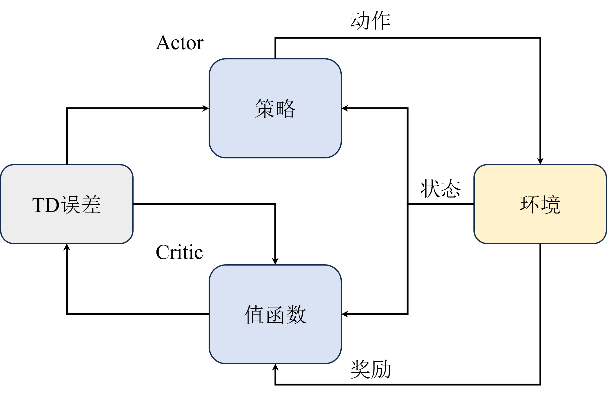
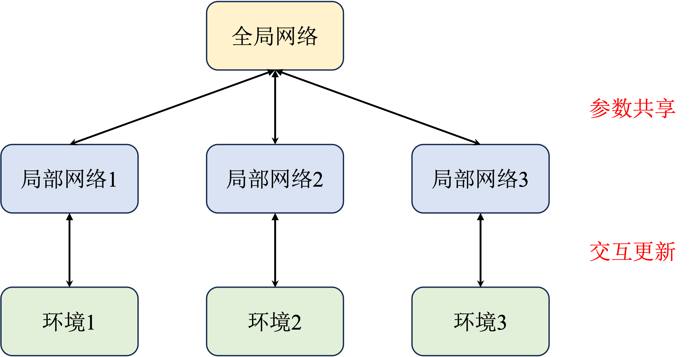

# Actor-Critic 算法

在策略梯度算法 (Policy Based method) 中已经提到, $Q^{\pi}(s,a)$ 部分对应着 `Critic`, 而 $\nabla_{\theta} \log \pi_{\theta}(a|s)$ 被称为 `Actor`.
- Actor 负责`估计策略梯度` 和 `采样`
- Critic 负责`估计价值函数` (不再需要负责采样)

## 策略梯度算法(REINFORCE)的缺陷
讲缺点前, 回顾一下它相比 DQN 算法的优点:
1. 可以处理连续动作空间
2. 可以处理随机性更强的环境


缺点则是:
1. 采样效率低
    > 使用蒙特卡洛估计, 这个做法对比时序差分方法效率要低.
2. 高方差
   > 由于使用蒙特卡洛估计, 估计的方差较大, 使得训练不稳定. 
   >> 值得注意的是, 估计梯度时使用蒙特卡洛采样产生方差甚至要比基于价值的方法还高.
   >>> 高方差原因分析: 策略梯度算法是因为直接对策略参数化，相当于既要利用策略去**与环境交互采样**，又要利用**采样去估计策略梯度**; 
   基于价值的算法也是需要与**环境交互采样**来估计值函数的，因此也会有高方差的问题。

3. 收敛性差
   > 容易陷入局部最优, 不能保证收敛到全局最优.
   >> 由于策略空间复杂, 可能存在多个局部最优点

4. 难处理高维离散空间
    > 采样效率容易受到高维离散空间的限制, 因为每个动作的采样都要计算一次策略. 如果空间很大, 就会消耗很多计算资源.

Actor-Critic 算法则同时兼顾了策略梯度算法和基于价值的方法的优点, 并在一定程度上缓解了高方差的问题. 由于 Actor 负责估计策略梯度和采样, 而 Critic 只负责估计策略函数的值函数, 此时的策略函数的价值变得相对更稳定, 因此在后续更新 Actor 的时候就能缓解策略梯度带来的高不确定性(高方差)的问题.
- 注意, 高方差问题仅仅是缓解, 并没有解决.


---

# Q Actor-Critic 算法
这个算法现在已经弃用, 但是由于后续不少改进算法都借鉴了它的核心思想, 故值得学习.

回顾 Actor-Critic 算法中, 它的目标函数是:
$$
J(\theta) \propto \mathbb{E}_{\pi_{\theta}}[Q^{\pi}(s, a) \nabla_{\theta} \log \pi_{\theta}(a|s)]
$$
- 对应到 REINFORCE 算法中的话, 上面的 Q函数 $Q^{\pi}(s_t, a_t)$ 对应的是蒙特卡洛估计, 表示 "当前状态-动作 $(s_t, a_t)$"的价值, 输入是状态和动作, 输出是一个值.
  - 这同时也是 Critic 部分.

如果`用一个神经网络来替代 Critic 部分`, 也就是 $Q_{\phi}(s_t, a_t)$, 其中 $\phi$ 是 Critic 的网络参数, 那么 Actor-Critic 算法就变成了 **Q Actor-Critic 算法**. 目标函数写成:
$$
J(\theta) \propto \mathbb{E}_{\pi_{\theta}}[Q_{\phi}(s, a) \nabla_{\theta} \log \pi_{\theta}(a|s)]
$$

通常, Actor 和 Critic 会被视为两个单独的模块, 分别对应着 策略函数(Policy) 和 价值函数(Value) 的估计. 如下图所示:

- Actor 与环境采样, 然后将采样的轨迹输入到 Critic 网络
- Critic 网络估计出 当前状态-动作 所对应的价值, 然后将这个价值作为 Actor 的梯度更新依据.

---

# A2C 与 A3C算法
Actor-Critic 架构能缓解高方差问题, 但缓解程度有限, 为了进一步降低方差, 可以引入一个**优势函数(advantage function)** $A^{\pi}(s_t, a_t)$, 它表示 当前状态-动作 **相对于平均水平的优势**.
$$
A^{\pi}(s_t, a_t) = Q^{\pi}(s_t, a_t) - V^{\pi}(s_t)
$$
- 右侧被减去的项被称为基线, 理论上它可以被自由设计, 但通常会选择状态价值函数 $V^{\pi}(s_t)$. 减去基线后, 会让梯度估计更加稳定.
  > 这里的讲的"基线"是指在`同一个状态`下的基线, 即 $V^{\pi}(s_t)$本身, 而不是$V^{\pi}(s_t)$的均值.
  > 优势函数可以理解为在给定状态 $s_t$ 下，选择动作 $a_t$ 相对于平均水平的优势。
  >> 如果优势为正，则说明选择这个动作比平均水平要好，反之如果为负则说明选择这个动作比平均水平要差。换句话说，原先对于每一对 状态-动作 只能以自己为参照物估计，现在可以平均水平为参照物估计了，这样就能减少方差。

引入优势函数后, 目标函数变成:
$$
J(\theta) \propto \mathbb{E}_{\pi_{\theta}}[A^{\pi}(s_t, a_t) \nabla_{\theta} \log \pi_{\theta}(a|s)]
$$
- 这个方法称为 **Advantage Actor-Critic** (A2C) 算法.
  - A2C算法并非一篇单独的论文, 而是在异步形式的 A2C算法 (asyncronous advantage actor-critic, A3C) 中提出的, 算法原理与 A2C 相同, 只不过存在 多进程 的概念, 提高了训练效率.

A3C算法结构如下图:

原先的 A2C 算法相当于只有一个全局网络并持续与环境交互更新。而 A3C 算法中增加了多个进程，每一个进程都拥有一个独立的网络和环境以供交互，并且每个进程每隔一段时间都会将自己的参数同步到全局网络中，这样就能提高训练效率。
- 这种训练模式也是比较常见的多进程训练模式，也能用于其他算法中，也包括前面讲到的基于价值的算法。

---

# 广义优势估计
上面提到的优势函数虽然减去了基线, 从而缓解了高方差问题, 但它本质上还是基于蒙特卡洛算法, 方差问题仍然存在. 

对比之前 Q-learning 之类的基于价值的算法, 它们使用的是 **时序差分算法**, 也就是基于贝尔曼方程的更新. 
- 时序差分方法能有效解决高方差的问题, 但它给出的估计是**有偏估计**, 也就是说它的期望值不一定是真实值. 而蒙特卡洛算法给出的估计是无偏估计, 但方差较大. 

因此, 就有学者想将它们融合起来, 于是提出了 **广义优势估计(Generalized Advantage Estimation, GAE)** 算法.
- 为了提高计算效率, GAE结合了 **n-step 的折扣回报** 来改进优势函数, 所以最后人们将这种估计也称为 **TD($\lambda$)** 估计.

GAE的公式如下:
$$
\begin{aligned}
A^{\text{GAE}(\gamma, \lambda)}(s_t, a_t) &= \sum_{l=0}^{\infty} (\gamma \lambda)^l \delta_{t+l} \\
 &= \sum_{l=0}^{\infty} (\gamma \lambda)^l [r_{t+l} + \gamma V^{\pi}(s_{t+l+1}) - V^{\pi}(s_{t+l})]
\end{aligned}
$$
- 其中 $\delta_{t+l}$ 表示 time step 为 $t+l$ 时的 TD error, $\lambda$ 是一个超参数, 用来平衡 n-step 的回报和优势函数的权重.
  - $\lambda = 0$ 时, GAE退化为单步的 TD error, 即 $A^{\text{GAE}(\gamma, 0)}(s_t, a_t) = \delta_t = r_t + \gamma V^{\pi}(s_{t+1}) - V^{\pi}(s_t)$

  - $\lambda = 1$ 时, GAE退化为蒙特卡洛估计, 即 $A^{\text{GAE}(\gamma, 1)}(s_t, a_t) = \sum_{l=0}^{\infty} (\gamma \lambda)^l \delta_{t+l} = \sum_{l=0}^{\infty} \gamma^l\delta_{t+l}$


$\lambda$ 的选择可以回看前面时序差分的内容, 一般来说, $\lambda$ 越小, 估计的方差越小, 但是偏差会增大. 通常 $\lambda$ 的选择是一个超参数, 通过实验来调整.

GAE 是一种通用的模块，在实践中可以用在任何需要估计优势函数的地方, 后续的PPO算法中就用到了这个方法.


---

# 练习题
1. 相比 REINFORCE 算法, A2C 的主要改进点在哪里? 为什么能提高速度?
> A2C算法引入了优势函数, 通过减去基线, 使得梯度估计更加稳定, 从而提高了训练速度. 同时, A2C 里还可以用多进程的方式来训练, 进一步提高训练速度.

2. A2C算法是On-Policy 的吗? 为什么?
是的. 原因如下:
    ```txt
    1. 策略更新方式：
    在On-Policy算法中，策略的更新是基于当前策略生成的数据。A2C算法在每一步中使用当前策略进行采样，并根据这些采样结果来更新策略。这意味着每次策略更新时所使用的数据都是从当前策略中获得的，这就是On-Policy方法的特点。

    2. 数据采样：
    A2C算法通过执行当前策略来收集数据，然后利用这些数据来估计值函数和优势函数，并基于这些估计结果来更新策略。在这个过程中，采样的数据与策略的更新是紧密相关的，并且策略的改进完全依赖于当前策略的表现。

    3. 与Off-Policy算法的区别：
    与Off-Policy算法（例如DQN或DDPG）不同，Off-Policy算法可以利用过去存储的数据（经验回放缓冲区）来进行策略更新。它们可以从一个策略生成数据，并用这些数据来更新另一个策略。而On-Policy算法，如A2C，始终依赖于当前策略生成的数据，这意味着每次更新策略时，数据必须是最新的。

    4. 实现机制：
    在A2C中，actor（策略网络）生成动作，然后通过环境交互收集到的回报用于更新critic（价值网络）和actor自身。这个更新过程是直接依赖于当前策略生成的数据的。

    综上所述，A2C算法是一个典型的On-Policy算法，因为它在每次策略更新时都依赖于当前策略生成的最新数据。
    ```
