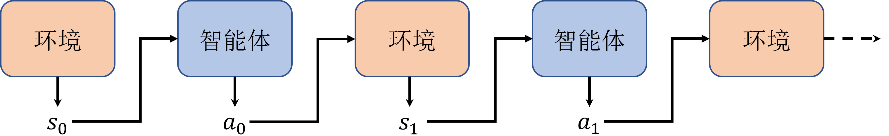
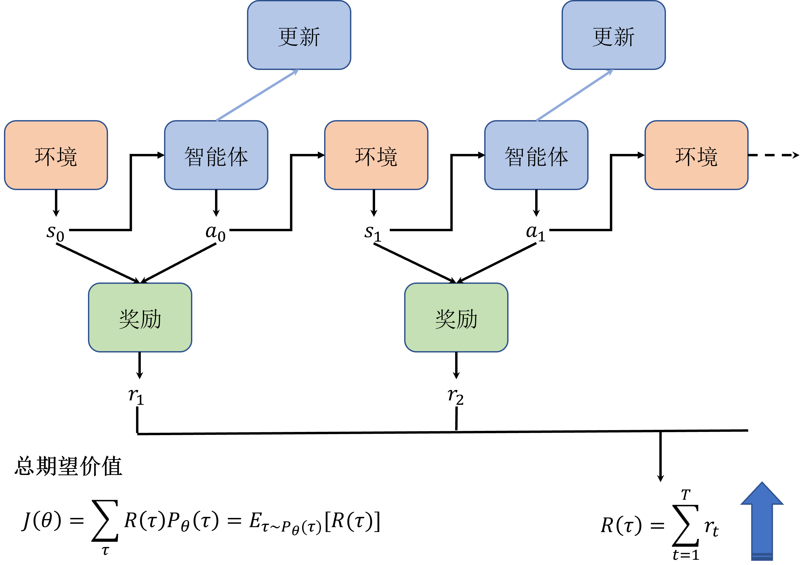
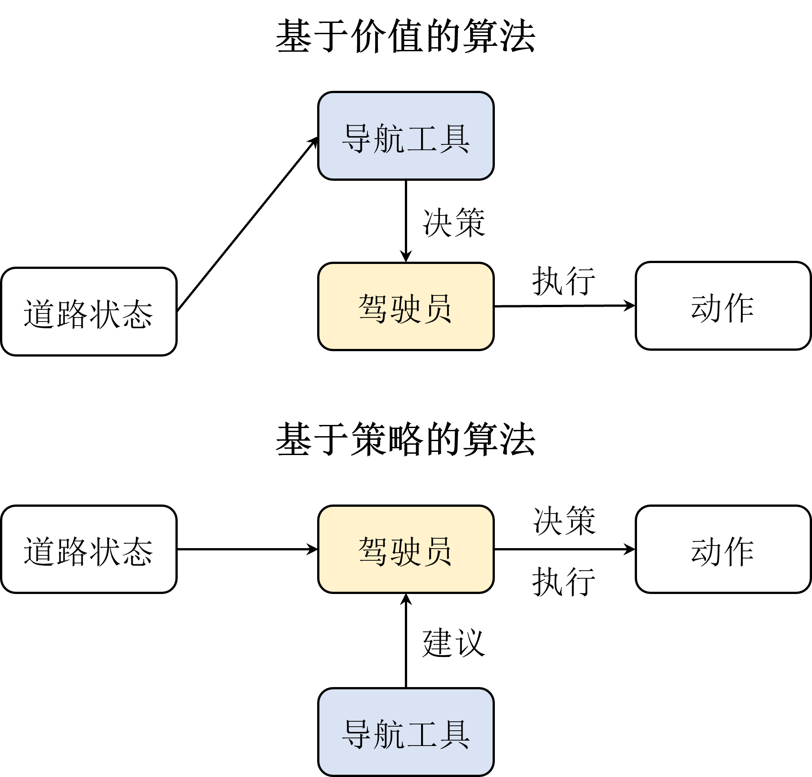
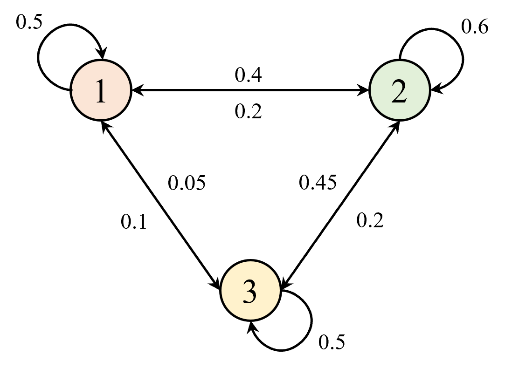

# 策略梯度
前面章节中提到的 DQN (Deep Q-Network) 是一种基于`价值函数的方法`, 它的目标是直接学习最优策略的值函数. 但是, 有时候我们也可以通过直接`学习策略`来解决问题. 这种方法被称为 Policy-based 方法.

"策略" 可以被描述成一个带有参数 $\theta$ 的**连续函数**, 它的输入是某个状态, 输出则是动作的概率分布.
- 之前章节里的策略 $\pi$ 是输出某个确定性(deteministic)的离散动作.

基于价值的算法 (如 DQN) 虽然在很多问题上表现得很好, 但是它们有一些缺点:
1. 无法表示连续的动作
    > 机器人的运动控制就属于连续问题, 因为动作空间是连续的, 比如速度, 角度等.
2. 高方差(不确定度高)
   > 前一个章节中的 DQN 和 advanced DQN 里的方法都有一个很明显的操作 -- `通过采样来估计Q值`, 这就必然导致估计值的方差很大, 不确定度很高, 从而影响算法的收敛性. 即便后期的改进算法可以一定程度上减少方差, 但是这是硬伤, 无法根除.
3. 存在探索与利用之间的平衡问题
    > 前面章节中, 我们在伪代码中都有使用 $\epsilon$-greedy 策略来解决探索问题. 但它不是很灵活, 也不是很高效.

---

策略梯度算法指的是一类通过直接学习策略来解决问题的算法. 它的目标是直接最大化期望回报, 也就是获得 $V^*$, 这与基于价值函数的方法的最终目的是一致的.

通常, 策略会使用 $\pi_{\theta}(a|s)$ 来表示, 其中 $\theta$ 是策略的参数, $a$ 是动作, $s$ 是状态. 
- $\pi_{\theta}(a|s)$ 表示在状态 $s$ 下, 选择动作 $a$ 的概率分布 $p(a|s)$.

回顾一下智能体与环境的交互过程:

> 环境首先产生一个状态 $s_0$, 然后智能体根据策略 $\pi_{\theta}$ 选择动作 $a_0$, 然后环境根据动作 $a_0$ 产生奖励 $r_1$ 和下一个状态 $s_1$, 以此类推.
>> 从$s_0$ 到 $s_t$ 这整个过程就是一个回合 (episode).
>> 将一个回合内的所有状态和动作按顺序组合, 就得到了一个轨迹 (trajectory). 如 
$ \tau = {s_0, a_0, r_1, s_1, a_1, r_2, s_2, \cdots , r_T, s_T}$  


假如我们只探讨一个很简单的轨迹 $\tau_0  = {s_0, a_0, s_1}$, 即智能体只执行一个动作后就停止本回合 (此时奖励为0, 就不写出来了). 同时, 为了方便公式化, 我们还假设:
- 由于环境的初始化是随机的, 它也服从某个概率分布, 那么, 我们假设环境产生的初始状态 $s_0$ 的概率为 $p(s_0)$
- 智能体做出动作的策略函数是 $\pi_{\theta}(a|s)$
- 产生轨迹 $\tau$ 的概率用 $P_{\theta}(\tau)$ 表示.

整个过程其实就三个概率事件: 初始化环境状态$s_0$, 然后是智能体根据$s_0$执行动作 $a_0$, 最后是环境转移到状态 $s_1$. 所以用公式表示为:
$$
P_{\theta}(\tau_0) = p(s_0) \pi_{\theta}(a_0|s_0) p(s_1|s_0, a_0)
$$

将这个过程推广到到任意轨迹 (注意马尔可夫性质), 就得到`某个轨迹出现的概率`$P_{\theta}(\tau)$:
$$
\begin{aligned}
P_{\theta}(\tau) &= p(s_0) \pi_{\theta} (a_0|s_0) p(s_1|s_0, a_0) \pi_{\theta} (a_1|s_1) p(s_2|s_1, a_1) \cdots \pi_{\theta} (a_{T-1}|s_{T-1}) p(s_T|s_{T-1}, a_{T-1}) \\
&= p(s_0) \prod_{t=0}^{T-1} \pi_{\theta}(a_t|s_t) p(s_{t+1}|s_t, a_t)
\end{aligned}
$$

有了轨迹的公式描述, 我们来看优化目标, 依然是**最大化每个回合的累计奖励的期望**, 也就是回报 G (Return). 如果将每一个 time step 中状态和动作所对应的奖励记为一个函数:
$$
r_{t+1} = r(s_t, a_t),  \quad  t = 0,1, \cdots
$$
此时, 我们就可以计算出一个轨迹的累计奖励:
$$
R(\tau) = \sum^T_{t=0} r(s_t, a_t)
$$
- 这里为了简单, 省去了折扣因子 $\gamma$ 

整个过程如下图所示:


由于初始化得到的不同环境就会对应着不同的轨迹, 因此, 我们可以据此计算出策略的总期望价值公式:
$$
\begin{aligned}
J(\theta) &= E_{\tau \sim P_{\theta}(\tau)}[R(\tau)] \\
          &= P_{\theta}(\tau_1) R(\tau_1) + P_{\theta}(\tau_2) R(\tau_2) + \cdots + P_{\theta}(\tau_n) R(\tau_n) \\
          &= \int P_{\theta}(\tau) R(\tau) d\tau \\
          &= E_{\tau \sim P_{\theta}(\tau)}[\sum r(s_t, a_t)]
\end{aligned}
$$
- 这就是我们优化的**目标函数**
  - 有了目标函数, 就可以用梯度上升/梯度下降的方法来求解了.
  - 由于$R(\tau)$ 和 $\theta$ 之间是没有联系的, 因此我们主要针对 $P_{\theta}(\tau)$ 求梯度.

Trick -- 使用对数求微分:
$$
\begin{aligned}
\nabla_{\theta} J(\theta) &= \nabla_{\theta} E_{\tau \sim P_{\theta}(\tau)}[\sum r(s_t, a_t)] \\
                          &= \nabla_{\theta} \int P_{\theta}(\tau) R(\tau) d\tau \\
                          &= \int \nabla_{\theta} P_{\theta}(\tau) R(\tau) d\tau \\
                          &= \int P_{\theta}(\tau) \nabla_{\theta} \log P_{\theta}(\tau) R(\tau) d\tau \\
                          &= E_{\tau \sim P_{\theta}(\tau)}[\nabla_{\theta} \log P_{\theta}(\tau) R(\tau)]
\end{aligned}
$$
- 这里所有的 $log$ 都是以 $e$ 为底的自然对数. 

由于 $P_{\theta}(\tau)$ 是由 $p(s_0)$ 和 $\pi_{\theta}(a_t|s_t)$ 乘积得到的, 因此我们可以将上式进一步展开:
$$
\begin{aligned}
\nabla_{\theta} J(\theta) &= E_{\tau \sim P_{\theta}(\tau)}[\nabla_{\theta} \log P_{\theta}(\tau) R(\tau)] \\
                          &= E_{\tau \sim P_{\theta}(\tau)} \left[\nabla_{\theta} \log \left[p(s_0) \prod_{t=0}^{T} \pi_{\theta}(a_t|s_t) p(s_{t+1}|s_t, a_t) \right] R(\tau) \right] \\
                          &= E_{\tau \sim P_{\theta}(\tau)} \left[ \left( \nabla_{\theta} \log p(s_0) + \sum_{t=0}^{T} \nabla_{\theta} \log \pi_{\theta}(a_t|s_t) + \nabla_{\theta} \log p(s_{t+1}|s_t, a_t) \right) R(\tau) \right] \\
                          &= E_{\tau \sim P_{\theta}(\tau)} \left[ \sum_{t=0}^{T} \nabla_{\theta} \log \pi_{\theta}(a_t|s_t) R(\tau) \right]
\end{aligned}
$$
- 推导过程中, 与$\theta$ 无关的项的微分为0, 所以直接省掉了.

为了具体地理解 基于价值函数的算法 与 基于策略梯度的算法 之间的区别, 下面给了一个地图与驾驶员的例子:

- 对于 "基于策略梯度的算法": 驾驶员和地图导航工具的训练是相互独立的，地图导航工具并不会干涉驾驶员的决策，只是会给出建议。这样的好处就是驾驶员可以结合经验自己去探索，当导航工具出现偏差的时候也可以及时纠正，反过来当驾驶员决策错误的时候，导航工具也可以及时矫正错误。
- 对于 "基于价值函数的算法": 相当于是在学一个地图导航工具，它会告诉并指导驾驶员从当前位置到目的地的最佳路径。但是这样会出现一个问题，就是当地图导航工具在学习过程中产生偏差时会容易**一步错步步错**，也就是估计价值的方差会很高，从而影响算法的收敛性。


---

# REINFORCE 算法
这是一种基于蒙特卡洛思想的方法. 简单来说, REINFORCE 算法的说法就是**每次采样 N 条轨迹**, 然后**对N条轨迹的梯度求平均**.

$$
\begin{aligned}
\nabla_{\theta} J(\theta) &= E_{\tau \sim P_{\theta}(\tau)}[\nabla_{\theta} \log P_{\theta}(\tau) R(\tau)] \\
                          &\approx \frac{1}{N} \sum_{i=1}^{N} \sum_{t=0}^{T_n} G^n_t \nabla_{\theta} \log \pi_{\theta}(a^n_t|s^n_t)
\end{aligned}
$$
注意, 这里的 $G^n_t$ 是第 n 条轨迹的第 t 个 time step 的回报, 是带有折扣因子 $\gamma$ 的:
$$
G^n_t = \sum_{k=0}^{T_n} \gamma^{k-t} r^n_k
$$

结合贝尔曼方程, 将当前时刻与下一个时刻联系起来, 就可以简化一下:
$$
\begin{aligned}
\nabla_{\theta} J(\theta) &\approx \frac{1}{N} \sum_{i=1}^{N} \sum_{t=0}^{T_n} \left( \sum_{k=t}^{T_n} \gamma^{k-t} r^n_k \right) \nabla_{\theta} \log \pi_{\theta}(a^n_t|s^n_t) \\
                          &\approx \frac{1}{N} \sum_{i=1}^{N} \sum_{t=0}^{T_n} \left( r_{t+1} + \gamma G_{t+1} \right) \nabla_{\theta} \log \pi_{\theta}(a^n_t|s^n_t)
\end{aligned}
$$


# 策略梯度推导进阶
前面的推导式子因为无法直接求解, 我们使用了蒙特卡洛的方式, 用多次采样去拿到一个近似解. 本质上, 我们主要使用了 总奖励 $R(\tau)$ 或者说 回报$G(\tau)$ 来求解(或说评估)某个轨迹的价值.

但这么做毕竟只是近似, 它不是特别稳定, 影响稳定性的因素可以是 回合的长度, 奖励的稀疏性等. 故我们下面想推导出另一种更通用的策略梯度公式.

## 平稳分布
这里的平稳分布指的是 `马尔可夫链的平稳分布`(stationary distribution).
- 平稳指的是: 在**无外界干扰**的情况下，系统长期运行之后其**状态分布会趋于一个固定的分布**，不再随时间变化。
    > 比如初中化学中我们知道，当我们把一块金属钠放到水中，会发生化学反应变成氢氧化钠，在反应的过程中是比较剧烈的，但在一段时间之后它总能稳定生成氢氧化钠，即在我们预测范围之内，而不会某几次实验之后突然生成氯化钠之类的物质。

平稳分布有如下两个性质:
1. 在平稳分布的前提下, 任意两个状态之间都是相互连通的, 即任意两个状态之间都是可以**通过一定的步骤**互相到达的, 该性质称为 `连通性`(connectedness).
   - 相应地, 如果进入某个状态后，切换到其他状态的概率变成 0 时, 这个时候连通性就不成立了，我们把这个状态也叫做**吸收状态**。
   - 终止状态不是吸收状态, 因为当进入终止状态后, 一般就会切回到初始状态.

2. 任意状态在平稳分布下的概率都是一样的，即**任意状态的概率都是相等的**，这个性质称为细致平稳（detailed balance）

这两个性质是等价的, 即**如果一个马尔可夫链满足了细致平稳性质，那么它一定满足连通性**，反之亦然。


### 平稳分布例子
比如一个简单的马尔可夫链:

它的状态转移矩阵为:
$$
P = \begin{bmatrix}
0.5 & 0.4 & 0.1  \\
0.2 & 0.6 & 0.2  \\
0.05 & 0.45 & 0.5
\end{bmatrix}
$$

假设我们有一批数量足够多的并且处于状态1的样本, 它们对应这三个状态的比例为 $\pi_0 = [0.15, 0.62, 0.23]$, 也就是说, 在这些样本中, 
- 有0.15的比例处于状态1, 0.62的比例处于状态2, 0.23的比例处于状态3.

那么, 经过一次状态转移后:
- 原来处于状态1的样本有0.15的比例停留在状态1, 原来处于状态2的样本有2的比例转移到状态1, 处于状态3的样本有0.05的比例转移到状态1. 
  - 因此, 经过一次状态转移后, 处于状态1的样本比例为 $0.15 \times 0.5 + 0.62 \times 0.2 + 0.23 \times 0.05 ≈ 0.210$
- 同理, 经过一次状态转移后, 处于状态2的样本比例为 $0.15 \times 0.4 + 0.62 \times 0.6 + 0.23 \times 0.45 ≈ 0.536$
- 处于状态3的样本比例为 $0.15 \times 0.1 + 0.62 \times 0.2 + 0.23 \times 0.5 ≈ 0.254$

所以 $\pi_2 = [0.210, 0.536, 0.254]$, 这其实就是一个矩阵乘法.

用python代码写出来就是:
```python
import numpy as np
pi_0 = np.array([[0.15,0.62,0.23]])
P = np.array([[0.5,0.4,0.1],[0.2,0.6,0.2],[0.05,0.45,0.5]])
for i in range(1,10+1):
    pi_0 = pi_0.dot(P)
    print(f"第{i}次状态转移后的样本比例为：")
    print(np.around(pi_0,3))
```

输出:
```txt
第1次状态转移后的样本比例为：
[[0.211 0.536 0.254]]
第2次状态转移后的样本比例为：
[[0.225 0.52  0.255]]
第3次状态转移后的样本比例为：
[[0.229 0.517 0.254]]

第4次状态转移后的样本比例为：
[[0.231 0.516 0.253]]
第5次状态转移后的样本比例为：
[[0.231 0.516 0.253]]
第6次状态转移后的样本比例为：
[[0.231 0.516 0.253]]
第7次状态转移后的样本比例为：
[[0.232 0.516 0.253]]
第8次状态转移后的样本比例为：
[[0.232 0.516 0.253]]
第9次状态转移后的样本比例为：
[[0.232 0.516 0.253]]
第10次状态转移后的样本比例为：
[[0.232 0.516 0.253]]
```
可以发现, 第5次状态转移之后, 样本分布就平稳了!

换句话说，无论初始状态是什么，经过多次概率转移之后都会存在一个稳定的状态分布。其次我们**只需要知道这个稳定的分布**并**乘以对应的价值**，就可以计算所谓的**长期收益**了。

小结:
- 对于任意马尔可夫链, 如果满足以下两个条件:
1. 非周期性
   - 由于马尔可夫链需要收敛，那么就一定不能是周期性的，实际上我们处理的问题基本上都是非周期性的，这点不需要做过多的考虑。
2. 状态连通性
   - 存在概率转移矩阵 $P$，能够使得任意状态 $s_0$, 经过有限次转移到达状态 $s$，反之亦然。
就可以说**这个马尔可夫链一定存在一个平稳分布**:
$$
d^{\pi}(s) = \lim_{t \to \infty} P(s_t = s | s_0, \pi_{\theta})
$$
- 注意: $d^{\pi}(s)$ 是**环境中的一个常量**, 类似于状态转移概率矩阵, 但是我们在求解马尔可夫决策过程中**一般无法直接获得, 只能通过其他方法去近似**.

## 基于平稳分布的策略梯度推导
回顾轨迹的概率公式:
$$
P_{\theta}(\tau) = p(s_0) \prod_{t=0}^{T-1} \pi_{\theta}(a_t|s_t) p(s_{t+1}|s_t, a_t)
$$
结合平稳分布我们可以发现, 如果轨迹的初始状态是 $s_0$ 且终止状态是 $s$ 时, $P_{\theta}(\tau)$ 与 $d^{\pi}(s)$ 是等效的. 只不过此时有个前提, 就是 $T \rightarrow \infty$.


此时, 策略梯度的目标函数可以写成:
$$
\begin{aligned}
J(\theta) &= \sum_{s \in S} d^{\pi}(s) V^{\pi}(s) \\
        & = \sum_{s \in S} d^{\pi}(s) \sum_{a \in A} \pi_{\theta}(a|s) Q^{\pi}(s,a)
\end{aligned}
$$
- $V^{\pi}$ 表示策略 $\pi$ 下的状态价值函数, $Q^{\pi}$ 表示策略 $\pi$ 下的动作价值函数.

用对数的trick, 将上式转换成梯度的形式:
$$
\begin{aligned}
\nabla_{\theta} J(\theta) &= \sum_{s \in S} d^{\pi}(s) \sum_{a \in A} \nabla_{\theta} \pi_{\theta}(a|s) Q^{\pi}(s,a) \\
                          &= \sum_{s \in S} d^{\pi}(s) \sum_{a \in A} \pi_{\theta}(a|s) \frac{\nabla_{\theta} \pi_{\theta}(a|s)}{\pi_{\theta}(a|s)} Q^{\pi}(s,a) \\
                          &= \sum_{s \in S} d^{\pi}(s) \sum_{a \in A}  Q^{\pi}(s,a)  \left( \pi_{\theta}(a|s) \nabla_{\theta} \log \pi_{\theta}(a|s) \right)\\
                          &= E_{\pi_{\theta}}[Q^{\pi}(s,a) \nabla_{\theta} \log \pi_{\theta}(a|s) ]
\end{aligned}
$$

REINFORCE 算法只是利用蒙特卡洛的方式将公式中的 $Q^{\pi}(s,a)$ 替换成了 $G(\tau)$ 罢了. 

结合深度学习, 我们可以将 $Q^{\pi}(s,a)$ 换成神经网络模型来近似, 不过此时的模型输出不再是**所有** action 对应的Q值了, 而是针对当前状态和动作, 也就是 $(s_t,a_t)$ 所对应的 **单个**Q值.
- 此时的模型的作用是 **评估策略的价值**, 而不是 **状态的价值**, 这种模型一般称为 `Critic`.
  - 对应地, 只包含策略地图的那部分 $\nabla_{\theta} \log \pi_{\theta}(a|s)$ 被称为 `Actor`.

---

# 策略函数的设计

## 离散动作的策略函数
因为这里要输出动作的分布, 所以不管网络的前面用什么样的东西, 最后输出的时候我们一般使用 softmax 函数作为激活函数:
$$
\pi_{\theta}(a|s) = \frac{e^{\phi(s,a)^T}\theta}{\sum_{a'} e^{\phi(s,a')^T}}
$$
- $\phi(s,a)$ 是模型前一层的输出.

梯度为:
$$
\nabla_{\theta} \log \pi_{\theta}(a|s) = \phi(s,a) - \mathbb{E}_{\pi_{\theta}} [\phi(s,\cdot)]
$$
- $\mathbb{E}_{\pi_{\theta}}[\phi(s,\cdot)]$ 表示所有输出之和, 即概率之和, 等于1.

于是进一步得到:
$$
\nabla_{\theta} \log \pi_{\theta}(a|s) = \log p_{\theta}(s,a)
$$
- 代码中一般会写作 logits_p, 而 $p_{\theta}(s,a)$ 称为 probs

## 连续动作的策略函数
连续的动作空间的策略所对应的动作概率分布一般服从高斯分布 $\mathbb{N}(\phi(s)^T \theta, \sigma^2)$, 对应的梯度为:

$$
\nabla_{\theta} \log \pi_{\theta}(a|s) = \frac{(a - \phi(s)^T \theta)\phi(s)}{\sigma^2}
$$
- 实现的时候, 一般是在模型最后一层输出两个值, 一个是均值, 一个是方差. 然后再构造一个高斯分布就行了.


---

# 练习题
1. 基于价值和基于策略的算法各有什么优缺点？
> 基于价值的算法优点是可以直接学习最优策略的价值函数, 但是无法表示连续动作, 且方差较大. 基于策略的算法可以直接学习策略, 可以表示连续动作, 但是训练速度较慢.

2. 马尔可夫平稳分布需要满足什么条件？
> 非周期性, 状态连通性.

3. REINFORCE 算法会比 Q-learning 算法训练速度更快吗？为什么？
> REINFORCE 算法的训练速度一般会比 Q-learning 算法慢, 因为它是基于蒙特卡洛的方法, 每次都需要采样多条轨迹, 从而导致训练速度较慢.

4. 确定性策略与随机性策略的区别？
> 确定性策略是在某个状态下, 选择一个确定的动作, 而随机性策略是在某个状态下, 选择一个动作的概率分布.
