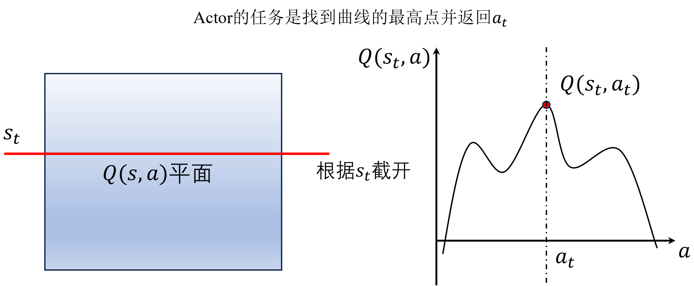
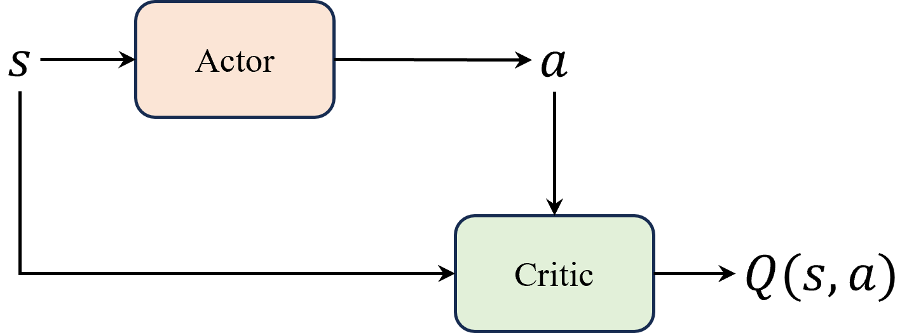

# DDPG 与 DPG 
DDPG (Deep Deterministic Policy Gradient, 深度确定性策略梯度算法)提出的初衷是解决DQN算法在`连续动作空间`上的问题.

抛开"Deep", DPG 是 DDPG 算法的核心, 要理解它, 首先回顾一下DQN, **DQN的缺陷主要是不能处理连续的动作空间**, 起因是它的动作选择机制是`贪心策略`, 也就是每次都选择Q值最大的动作(通过argmax来获得某个动作的index), 这样就导致了动作空间是离散的.
- Q函数本质上是对动作价值的评估, 因此它在 Actor-Critic 算法中扮演 Critic 的角色.

由此, 从DQN选择动作的机制, 我们可以联想到一种适配连续动作空间的办法: 
> 直接用一个函数 $\mu_{\theta}(s)$ 来整合 "由(s,a)估计Q函数 + 由Q函数贪心地选择动作" 的过程, 即输入是一个状态, 输出是某个动作.
- 此时, 这个 $\mu_{\theta}$ 在 Actor-Critic 架构中扮演 Actor 的角色.
- 注意, 这里**输出的是具体动作**, 而不是前面在 Actor-Critic 架构里提到的动作的概率分布 $\pi_{\theta}(a|s)$, **因此, DDPG 输出的动作是"确定的"**, 故称为 deterministic policy.

下面这张图很好地描述了 DDPG 算法中 Actor 的工作:

- $Q(s,a)$ 函数本质上需要两个输入, 如果画出来, $Q(s,a)$应该是一个曲面, 而当 Actor 接收某个状态(即 $s=s_t$)时, 就相当于在这个曲面上切出一个截面, 如图中左侧部分.
- 这个截面对应的是右图里的纵坐标 $Q(s_t, a)$, 而 Actor 的任务就是找到这个截面上的最大值$Q(s_t,a_t)$对应的动作 $a_t$.

所以，根据这个图解, **DDPG 算法并没有做真正意义上的梯度更新，只是在寻找最大值，本质上还是 DQN 算法的思路**.

由此, 就可以画出下面这张网络结构图, DDPG 算法的 Critic 需要接受两个输入 $s$ 和 $a$, 而不是 Actor-Critic 架构中的 Critic 只接受 $s$ 的输入, 毕竟 DDPG 的 Critic 就是 Q 函数.

DPG 算法的目标函数是:
$$
\nabla_{\theta} J(\theta) \approx \mathbb{E}_{s_t \sim \rho^{\beta}}[\nabla_a Q(s_t,a)|_{a=\mu_{\theta}(s_t)} \nabla_{\theta} \mu_{\theta}(s_t)]
$$
- 其中, $\rho^{\beta}$ 是一个用于探索的策略(策略的初始分布); 在DDPG中其实就是网络的初始权重.
- $Q(s_t,a)$ 在DDPG中相当于 Critic 网络, 将状态和动作作为输入，并且输出一个值。

---
题外话:
在强化学习中, 我们的研究方向总是围绕着两个话题:
1. 如何 "提高对值函数的估计"
2. 如何 "提高探索" 以及 "平衡探索-利用" 的问题

对于1, 我们的目标是让值函数的估计偏差尽可能小, 并且尽可能做到低方差.
> 比如:
>> 最开始的用深度神经网络替代简单的 Q-table;
>> 结合蒙特卡洛和时序差分的 $TD(\lambda)$;
>> 引入目标网络以及广义优势估计等等.

对于2, "提高探索"的问题主要针对 "确定性策略" 方法中, 比如 DQN 和 DPG, 他们都需要配合各种技巧来提高探索的比重.
> 比如: 经验回放, $\epsilon$-greedy 策略, 噪声网络.

---
## DDGP
DDPG 其实只是在 DPG 算法的基础上增加了`目标网络`, `经验回放` 以及 `引入噪声网络`而已.

值得注意的是, Noisy-DQN中的噪声网络增加了

---

# TD3
TD3 是 DDPG 算法的改进.