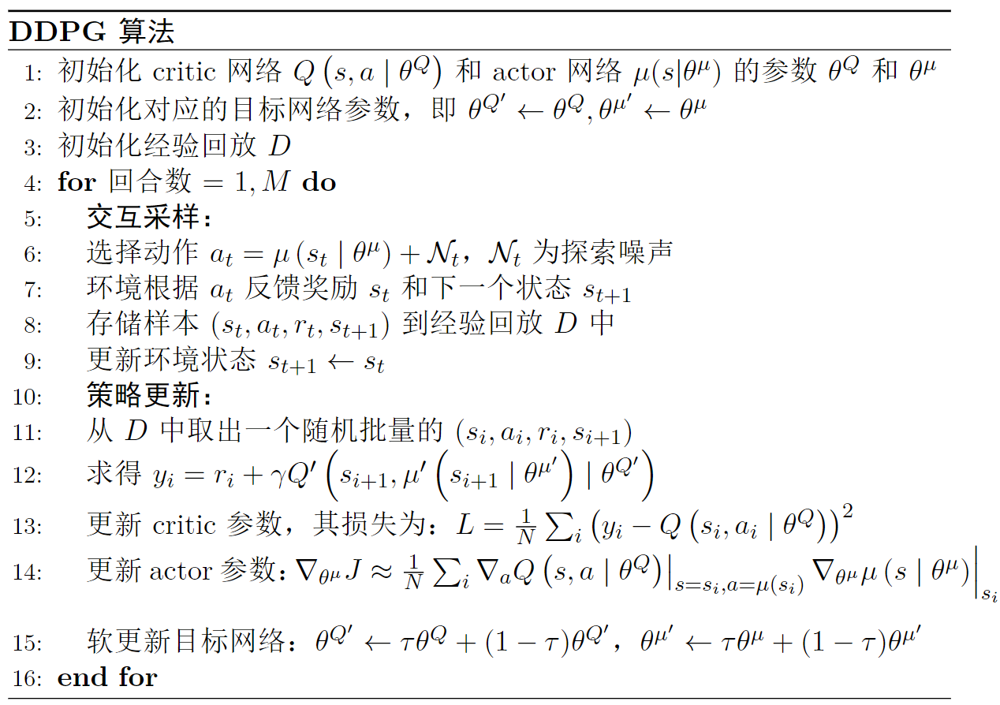

# DDPG 与 DPG 
DDPG (Deep Deterministic Policy Gradient, 深度确定性策略梯度算法)提出的初衷是解决DQN算法在`连续动作空间`上的问题.

抛开"Deep", DPG 是 DDPG 算法的核心, 要理解它, 首先回顾一下DQN, **DQN的缺陷主要是不能处理连续的动作空间**, 起因是它的动作选择机制是`贪心策略`, 也就是每次都选择Q值最大的动作(通过argmax来获得某个动作的index), 这样就导致了动作空间是离散的.
- Q函数本质上是对动作价值的评估, 因此它在 Actor-Critic 算法中扮演 Critic 的角色.

由此, 从DQN选择动作的机制, 我们可以联想到一种适配连续动作空间的办法: 
> 直接用一个函数 $\mu_{\theta}(s)$ 来整合 "由(s,a)估计Q函数 + 由Q函数贪心地选择动作" 的过程, 即输入是一个状态, 输出是某个动作.
- 此时, 这个 $\mu_{\theta}$ 在 Actor-Critic 架构中扮演 Actor 的角色.
- 注意, 这里**输出的是具体动作**, 而不是前面在 Actor-Critic 架构里提到的动作的概率分布 $\pi_{\theta}(a|s)$, **因此, DDPG 输出的动作是"确定的"**, 故称为 deterministic policy.

下面这张图很好地描述了 DDPG 算法中 Actor 的工作:

- $Q(s,a)$ 函数本质上需要两个输入, 如果画出来, $Q(s,a)$应该是一个曲面, 而当 Actor 接收某个状态(即 $s=s_t$)时, 就相当于在这个曲面上切出一个截面, 如图中左侧部分.
- 这个截面对应的是右图里的纵坐标 $Q(s_t, a)$, 而 Actor 的任务就是找到这个截面上的最大值$Q(s_t,a_t)$对应的动作 $a_t$.

所以，根据这个图解, **DDPG 算法并没有做真正意义上的梯度更新，只是在寻找最大值，本质上还是 DQN 算法的思路**.

由此, 就可以画出下面这张网络结构图, DDPG 算法的 Critic 需要接受两个输入 $s$ 和 $a$, 而不是 Actor-Critic 架构中的 Critic 只接受 $s$ 的输入, 毕竟 DDPG 的 Critic 就是 Q 函数.


DPG 算法的目标函数是:
$$
\nabla_{\theta} J(\theta) \approx \mathbb{E}_{s_t \sim \rho^{\beta}}[\nabla_a Q(s_t,a)|_{a=\mu_{\theta}(s_t)} \nabla_{\theta} \mu_{\theta}(s_t)]
$$
- 其中, $\rho^{\beta}$ 是一个用于探索的策略(策略的初始分布); 在DDPG中其实就是网络的初始权重.
- $Q(s_t,a)$ 在DDPG中相当于 Critic 网络, 将状态和动作作为输入，并且输出一个值。

---
题外话:
在强化学习中, 我们的研究方向总是围绕着两个话题:
1. 如何 "提高对值函数的估计"
2. 如何 "提高探索" 以及 "平衡探索-利用" 的问题

对于1, 我们的目标是让值函数的估计偏差尽可能小, 并且尽可能做到低方差.
> 比如:
>> 最开始的用深度神经网络替代简单的 Q-table;
>> 结合蒙特卡洛和时序差分的 $TD(\lambda)$;
>> 引入目标网络以及广义优势估计等等.

对于2, "提高探索"的问题主要针对 "确定性策略" 方法中, 比如 DQN 和 DPG, 他们都需要配合各种技巧来提高探索的比重.
> 比如: 经验回放, $\epsilon$-greedy 策略, 噪声网络.


---
## DDGP
DDPG 其实只是在 DPG 算法的基础上增加了`目标网络`, `经验回放` 以及 `引入噪声网络`而已.

值得注意的是, Noisy DQN 中的噪声是针对网络增加的, 而 DDPG 是针对输出动作增加的, 增加噪声的目的只是引入 "探索" 新动作的可能性, 而不是只采用某种常规套路.
- 在DDPG算法中, $\mu_{\theta}(s)$ 输出的是单个值, 表示某个动作. 引入噪声**最简单的方式**则是在输出上加上一个噪声, 以增加探索的比重.
  - 这个噪声可以是服从正态分布(高斯噪声)的, 也可以是服从均匀分布的, 只要确保则随机数不会太大即可.

实际使用的时候, DDPG 增加的噪声叫做`Ornstein-Uhlenbeck (OU)`噪声, 这是一种**具有回归特性的随机过程**, 相比高斯噪声, 它的优点有:
1. 探索性
    > OU噪声具有 持续性 和 自相关性, 这样可以使得动作的变化更加平滑, 有助于探索 或者说 有助于找到更好的策略. 
2. 控制幅度
    > OU噪声可以`调整方差`来控制噪声幅度, 从而平衡探索性和利用性. 
    >> 方差较大时, 探索的比重增大, 方差较小时, 利用的比重增大 
3. 稳定性
    > OU噪声的回归特性使得训练更加稳定, 因为这种噪声可以更好地保持动作的连续, 避免剧烈抖动.
4. 可控性
    > OU噪声的回归特性使得它在训练过程中逐渐回归到均值, 因此它让策略的探索比重逐渐减小. 
    >> 在训练早期, OU噪声的方差比较大, 注重于探索; 随着训练的进行, OU噪声的方差在减小, 就降低了探索的比重, 转而关注于利用.

因此, OU噪声更像是一种平衡 探索-利用 的工具, 而不是简单的增加随机性. 同时, 由于OU噪声的平滑特性, 使得 DDPG 可以应用到连续的动作空间中.

实际上在**简单的环境中**，它跟**使用简单的高斯噪声甚至不用噪声的效果是差不多的**，**只有在复杂的环境中才会体现出来区别**。因此，如果读者在实际应用中面临的问题比较简单，可以不用OU噪声，而是使用高斯噪声或者不用噪声即可，这样可以减少算法的复杂度，加快算法的收敛速度.

OU噪声的数学表达式如下:
$$
dx_t = \theta(\mu - x_t)dt + \sigma dW_t
$$
- 式中: 
  - t表示强化学习中的 time step; 
  - $x_t$ 表示t时刻OU噪声的值; 
  - $\mu$ 是最后回归到的均值; 
  - $\theta$ 是OU噪声的回归速率; 
  - $\sigma$ 是OU过程的扰动项, 也是**高斯噪声的标准差**; 
  - $dW_t$ 是布朗运动(Brownian motion)或维纳过程(Wiener process), 本质上是一个随机项, 用来表示高斯噪声的微小变化.
- 从公式可以看出, OU噪声由两部分组成, 前半部分是`回归项`, 后半部分是`随机高斯噪声`.

实际使用的时候, 我们调的是 $\mu, \sigma$ 这两个参数, $\theta$通常是固定的, $dW_t$则是随机性, 不需要特别关注.

### DDPG 优缺点
优点: 
1. 适用于连续动作空间
   > 它选择动作的时候采用的是确定的策略, 通过引入噪声项来增加探索性, 从而适用于连续动作空间.
   > 由于没有采样动作的过程, 因此也缓解了高方差问题.
2. 高效的梯度优化
   > 本质上 DDPG 可以认为是使用了 Actor-Critic 架构, 
3. 经验回放和目标网络
    > 经验回放机制可以减少样本之间的相关性，提高样本的有效利用率，并且增加训练的稳定性。
    > 目标网络可以稳定训练过程，避免值函数估计和目标值之间的相关性问题，从而提高算法的稳定性和收敛性


缺点:
1. 只适用于连续动作空间.
2. 高度依赖超参数
    > 如: learning rate, batch size, 目标网络更新频率, OU噪声参数. 
3. 高度敏感的初始条件
    > 初始策略和值函数的参数设置会影响到算法的收敛性, 也会影响性能.

4. 容易陷入局部最优
    > 由于采用了确定性策略，可能会导致算法陷入局部最优，难以找到全局最优策略。
    > 为了增加探索性，需要采取一些措施.
    >> 比如 加入噪声策略 或 使用其他的探索方法


---

# TD3
TD3 的全称是 Twin Delayed Deep Deterministic Policy Gradient, 也就是双延迟深度确定性策略梯度算法. 

TD3 是 DDPG 算法的改进. 主要改进点为:
1. 双 Q 网络, 这也是名字中 Twin 的由来.
2. 延迟更新, 名字中的 Delayed 的由来.
3. 噪声正则 (noise regularisation)


## 双Q网络
就是在DDPG算法的 Critic 网络中增加一层, 一共两个 Critic 网络, 记为 $Q_{\omega_1}, Q_{\omega_2}$, 下标 $\omega_1, \omega_2$ 是两个网络的参数.
- 此时将有两个Q值, 分别是 $Q_{\omega_1}(s_t, a_t), Q_{\omega_2}(s_t, a_t)$. 计算 TD error 的时候取两者的最小值. 

$Q_{\omega_1}$ 的损失函数如下:
$$
\begin{aligned}
L(\omega_1) &= \mathbb{E}_{(s_t, a_t, r_t, s_{t+1}) \sim D}[(Q_{\omega_1}(s_t, a_t) - y_t)^2] \\
y_t &= r_t + \gamma \min_{i=1,2} Q_{\omega_i'}(s_{t+1}, \mu_{\theta'}(s_{t+1})) \\
\end{aligned}
$$

$Q_{\omega_2}$ 的损失函数如下:
$$
\begin{aligned}
L(\omega_2) &= \mathbb{E}_{(s_t, a_t, r_t, s_{t+1}) \sim D}[(Q_{\omega_2}(s_t, a_t) - y_t)^2] \\
y_t &= r_t + \gamma \min_{i=1,2} Q_{\omega_i'}(s_{t+1}, \mu_{\theta'}(s_{t+1})) \\
\end{aligned}
$$

这与 Double DQN 的原理是一样的, 好处就是缓解Q值过估计问题, 提高算法的稳定性和收敛性.


## 延迟更新
延迟更新的思想是, 让 Critic 网络的参数更新频率比 Actor 网络的参数更新频率低 (更新频率`Critic > Actor`)
- 减少 Critic 网络的更新频率, 就减少了 Q 值的过估计, 进而提高算法的稳定性和收敛性.
> 说人话就是: **Critc 好比领导，Actor 则好比员工**. 
>> 如果Critic频繁更新, 就相当于领导不断给员工下达新目标，此时 Actor 就会马上响应, 哪怕之前的工作已经能获得相当不错的收益, 这相当于员工不顾一切地切换到新目标，而此时如果领导的决策经常失误(一拍脑袋, 想要五彩斑斓的黑)，那么员工就很容易像无头苍蝇一样不知道完成哪些目标才能让整个项目收益最大.
>> 总而言之就是: **让领导学得更快, 这样下达命令的出错率就低一些**.

实践中, **Critic 的更新频率要比 Actor 高一个数量级**. 
- 比如 Critic 更新10次, Actor 更新1次.

## 噪声正则
原论文中, 它其实不是这个叫法, 而是 `Target Policy Smoothing Regularisation`, 也就是目标策略平滑正则化, 不过意思差不多, 简化还好理解点.

上面提到的延迟更新方法只是让 Critic 出错的时候, Actor 的容错率高一点, 但这并没有从根本上让 Critic 少出错, 所以这里的出发点是给 Critic 对症下药. 

操作上就是对 Critic 增加一个噪声, 训练后就让它有了一定的抗干扰特性, 从而提高算法的稳定性和收敛性.
- 注意: 这里的**噪声是针对 Critic 网络引入的**, 而不是 DDPG 那种, 对 Actor 输出的动作加噪声.

这个过程用数学描述如下:
$$
\begin{aligned}
y = r + \gamma Q_{\theta'}(s', \pi (s') + \epsilon) \\
\epsilon \sim clip(\mathcal{N}(0, \sigma), -c, c)
\end{aligned}
$$
- 这表示在计算 TD error 时, 给目标值 y 增加了一个噪声, 并且为了限制噪声的大小, 用 clip 函数进行了限制.
- 式中, $N(0,\sigma)$ 是高斯噪声, $\epsilon$ 表示我们增加的正则化噪声, clip 函数是一个截断函数, 用来限制噪声的范围至 $[-c,c]$, 防止噪声过大. $c$是一个超参数.

这么做使得值函数更加平滑, 也就是 Critic 曲线更平滑, 不会突然拍脑袋做出无厘头的决定.

# 伪代码
## DDPG伪代码

- 注意第 15 步里, DDPG更新目标网络权重参数的方式是 `软更新`, 而不是 DQN 中的 `硬更新` (直接拷贝参数过去).
  - 目的也是获得更平滑的训练曲线, 因为这避免了网络突变带来的震荡.

代码实现的框架遵循 Actor-Critic 的结构, 核心部分如下:
- [x] 模型定义:
```python
import torch
import torch.nn as nn
import torch.nn.functional as F
class Actor(nn.Module):
    def __init__(self, state_dim, action_dim, hidden_dim = 256, init_w=3e-3):
        super(Actor, self).__init__()  
        self.linear1 = nn.Linear(state_dim, hidden_dim)
        self.linear2 = nn.Linear(hidden_dim, hidden_dim)
        self.linear3 = nn.Linear(hidden_dim, action_dim)
        
        self.linear3.weight.data.uniform_(-init_w, init_w)
        self.linear3.bias.data.uniform_(-init_w, init_w)
        
    def forward(self, x):
        x = F.relu(self.linear1(x))
        x = F.relu(self.linear2(x))
        x = torch.tanh(self.linear3(x)) # 输入0到1之间的值
        return x
        
class Critic(nn.Module):
    def __init__(self, state_dim, action_dim, hidden_dim=256, init_w=3e-3):
        super(Critic, self).__init__()
        
        self.linear1 = nn.Linear(state_dim + action_dim, hidden_dim)
        self.linear2 = nn.Linear(hidden_dim, hidden_dim)
        self.linear3 = nn.Linear(hidden_dim, 1)
        # 随机初始化为较小的值
        self.linear3.weight.data.uniform_(-init_w, init_w)
        self.linear3.bias.data.uniform_(-init_w, init_w)
        
    def forward(self, state, action):
        # 按维数1拼接
        x = torch.cat([state, action], 1)
        x = F.relu(self.linear1(x))
        x = F.relu(self.linear2(x))
        x = self.linear3(x)
        return x
```

- [x] 动作采样: 无需采样, 直接输出动作
```python
class Agent:
    def __init__(self):
        pass
    def sample_action(self, state):
        state = torch.FloatTensor(state).unsqueeze(0).to(self.device)
        action = self.actor(state)
        return action.detach().cpu().numpy()[0, 0]
```

- [x] 策略更新
```python
class Agent:
    def __init__(self):
        pass
    def update(self):
        # 从经验回放中中随机采样一个批量的样本
        state, action, reward, next_state, done = self.memory.sample(self.batch_size)
        actor_loss = self.critic(state, self.actor(state))
        actor_loss = - actor_loss.mean()

        next_action = self.target_actor(next_state)
        target_value = self.target_critic(next_state, next_action.detach())
        expected_value = reward + (1.0 - done) * self.gamma * target_value
        expected_value = torch.clamp(expected_value, -np.inf, np.inf)

        actual_value = self.critic(state, action)
        critic_loss = nn.MSELoss()(actual_value, expected_value.detach())
        
        self.actor_optimizer.zero_grad()
        actor_loss.backward()
        self.actor_optimizer.step()
        self.critic_optimizer.zero_grad()
        critic_loss.backward()
        self.critic_optimizer.step()
        # 各自目标网络的参数软更新
        for target_param, param in zip(self.target_critic.parameters(), self.critic.parameters()):
            target_param.data.copy_(
                target_param.data * (1.0 - self.tau) +
                param.data * self.tau
            )
        for target_param, param in zip(self.target_actor.parameters(), self.actor.parameters()):
            target_param.data.copy_(
                target_param.data * (1.0 - self.tau) +
                param.data * self.tau
            )
```

---

## TD3伪代码
TD3 与 DDPG 只在`策略更新`有差异, 因此这里就不贴伪代码的图了, 直接上策略更新的代码:

```python
def update(self):
    if len(self.memory) < self.explore_steps: # 当经验回放中不满足一个批量时，不更新策略
        return
    state, action, reward, next_state, done = self.memory.sample(self.batch_size) # 从经验回放中随机采样一个批量的转移(transition)
           # 将数据转换为tensor
    state = torch.tensor(np.array(state), device=self.device, dtype=torch.float32)
    action = torch.tensor(np.array(action), device=self.device, dtype=torch.float32)
    next_state = torch.tensor(np.array(next_state), device=self.device, dtype=torch.float32)
    reward = torch.tensor(reward, device=self.device, dtype=torch.float32).unsqueeze(1)
    done = torch.tensor(done, device=self.device, dtype=torch.float32).unsqueeze(1)
    noise = (torch.randn_like(action) * self.policy_noise).clamp(-self.noise_clip, self.noise_clip) # 构造加入目标动作的噪声
          # 计算加入了噪声的目标动作
    next_action = (self.actor_target(next_state) + noise).clamp(-self.action_scale+self.action_bias, self.action_scale+self.action_bias)
          # 计算两个critic网络对t+1时刻的状态动作对的评分，并选取更小值来计算目标q值
    target_q1, target_q2 = self.critic_1_target(next_state, next_action).detach(), self.critic_2_target(next_state, next_action).detach()
    target_q = torch.min(target_q1, target_q2)
    target_q = reward + self.gamma * target_q * (1 - done)
          # 计算两个critic网络对t时刻的状态动作对的评分
    current_q1, current_q2 = self.critic_1(state, action), self.critic_2(state, action)
          # 计算均方根损失
    critic_1_loss = F.mse_loss(current_q1, target_q)
    critic_2_loss = F.mse_loss(current_q2, target_q)
    self.critic_1_optimizer.zero_grad()
    critic_1_loss.backward()
    self.critic_1_optimizer.step()
    self.critic_2_optimizer.zero_grad()
    critic_2_loss.backward()
    self.critic_2_optimizer.step()
    if self.sample_count % self.policy_freq == 0:
              # 延迟策略更新，actor的更新频率低于critic
        actor_loss = -self.critic_1(state, self.actor(state)).mean()
        self.actor_optimizer.zero_grad()
        actor_loss.backward()
        self.actor_optimizer.step()
              #目标网络软更新
        for param, target_param in zip(self.actor.parameters(), self.actor_target.parameters()):
            target_param.data.copy_(self.tau * param.data + (1 - self.tau) * target_param.data)
        for param, target_param in zip(self.critic_1.parameters(), self.critic_1_target.parameters()):
            target_param.data.copy_(self.tau * param.data + (1 - self.tau) * target_param.data)
        for param, target_param in zip(self.critic_2.parameters(), self.critic_2_target.parameters()):
            target_param.data.copy_(self.tau * param.data + (1 - self.tau) * target_param.data)
```

# 小结
虽然 DDPG 和 TD3 归类到 Actor-Critic 算法中, 但它们的核心思想是基于 DQN 的, 也就是 Q-learning 的思想. 相当于 DQN 对连续动作空间的特定版本. 在需要确定性策略且连续动作空间的前提下，这类算法将是比较稳定的基线算法。


# 练习题

1. DDPG 是 off-policy 算法吗? 为什么?
    > Off-Policy定义：off-policy算法指的是训练过程中，使用的数据并不完全来自当前策略，而是可能来自于不同的策略（包括历史策略或其他探索策略）

    > 细看DDPG的几个trick:
    >> 经验回放（Replay Buffer）：DDPG使用了一个经验回放缓冲区，存储智能体过去的状态、动作、奖励和下一个状态的转移样本。训练时，DDPG会从这个缓冲区中随机抽取小批量样本进行更新。这意味着用于更新策略的样本可能并不是按照当前策略生成的，而是历史策略或探索策略的样本。
    >>探索策略（Exploration Policy）：在训练过程中，DDPG通常会使用一个噪声策略（如Ornstein-Uhlenbeck噪声）来促进探索。这种噪声会添加到决策过程中生成的动作上，使得实际执行的动作和当前策略不同，从而进一步体现了off-policy的特性。
    >> 目标网络（Target Networks）：DDPG采用了目标网络（target networks）来稳定训练过程。目标网络是对主网络（policy and critic networks）参数的延迟更新，这使得目标值的计算更稳定，但也使得训练过程更加off-policy，因为目标值并不是完全基于当前策略计算的。


2. 软更新相比于硬更新的好处是什么？为什么不是所有的算法都用软更新？
    > 好处是让训练更加稳定, 训练曲线更平滑.  
    > 不是所有的算法都用软更新, 是因为软更新会导致训练速度变慢, 从而增加了训练时间.

3. 相比 DDPG, TD3 算法做了哪些改进?
    > 1. 双Q网络; 2. 延迟更新; 3. 噪声正则.


4. TD3 算法中 Critic 的更新频率要比 Actor 更快还是更慢? 为什么?
    > TD3 中, Critic 更新更快, 因为这样可以减少 Q 值的过估计, 进而提高算法的稳定性和收敛性.
