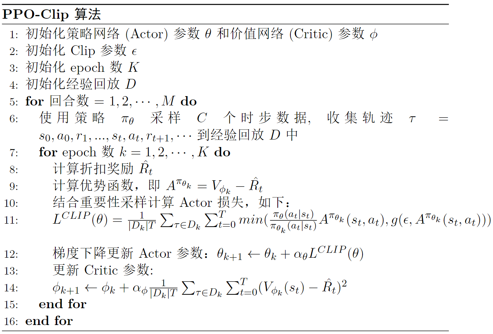

# PPO简介
PPO是典型的 `Actor-Critic` 算法, 同时适用于连续和离散的动作空间.

PPO 在2017由 OpenAI 的 Schulman 等人提出. 核心思想是通过`在策略梯度的优化过程中引入重要性权重来限制策略更新的幅度`, 从而提高算法的稳定性和收敛性. 
- 优点是简单, 易于实现, 调参简单. (遇事不决PPO)

PPO 的前身是 TRPO算法. TRPO算法也是基于策略梯度, 核心思想是 "定义策略更新的信赖域(trust region), 以此保证每次更新的策略与当前的策略偏差不会太大, 从而避免更新后性能下降". 但 TRPO 算法的缺点是约束优化问题过于复杂, 计算繁琐, 难以实现.
- 这里不详细展开, 原文可以参考: https://arxiv.org/abs/1502.05477


---

# 重要性采样
重要性采样(importance sampling) 是 PPO 里用到的非常重要的操作. 从概率论来说, 它是`一种估计 "随机变量的期望" 或者 "随机变量的概率分布" 的统计方法`.

简单描述一下重要性采样是个什么东西:
- 场景: 
    > 假设我们有一个函数$f(x)$, 计算$f(x)$的期望需要依赖 **目标分布** $p(x)$ 的采样值, 但是我们只知道$p(x)$的具体形式, 但是想要从中采样非常困难.

- 核心思想: 
    > 来一波狸猫换太子. 
    > 找个好操作的分布 $q(x)$, 只要我们从中采样的样本都可以 "修正" 到目标分布$p(x)$上, 那么我们就可以通过这些修正过的样本来近似得到 $f(x)$ 的期望值.
    >> 这个 "修正" 的工具就是所谓的 "重要性权重".
- 具体做法:
    > 找到一个**提议分布(proposal distribution)** $q(x)$, 从这个分布采样是一件很简单的事情, 对于每一个采样的样本, 乘以一个重要性权重 $\frac{p(x)}{q(x)}$, 就可以得到一个 "修正" 后的样本, 从而计算出 $f(x)$ 的期望.

用数学公式描述这个操作:
- 如果x是连续随机变量:
$$
\begin{aligned}
\mathbb{E}_{p(x)}[f(x)] &= \int f(x) p(x)  dx \\
&= \int f(x) q(x) \frac{p(x)}{q(x)}   dx \\
&= \mathbb{E}_{q(x)}\left[f(x) \frac{p(x)}{q(x)} \right]
\end{aligned}
$$

- 如果x是离散随机变量:
$$
\begin{aligned}
\mathbb{E}_{p(x)}[f(x)] &= \frac{1}{N} \sum f(x_i) p(x_i) \\
&= \frac{1}{N} \sum f(x_i) q(x_i) \frac{p(x_i)}{q(x_i)} \\
&= \frac{1}{N} \sum f(x_i) \frac{p(x_i)}{q(x_i)}
\end{aligned}
$$

这时候, 本来看着很难的事情就看起来简单多了, 不过此时还需注意: 
- 当$p(x)$不为0时, $q(x)$ 也不能为零, 但是他们可以同时为零, 这时候$\frac{p(x)}{q(x)}$ 依然有定义, 具体原理这里先不管, 反正先用起来.


在选取 $q(x)$ 的时候, 我们通常希望 $q(x)$ 能够尽可能的 "接近" $p(x)$, 这样重要性权重 $\frac{p(x)}{q(x)}$ 就会尽可能的接近1, **从而减小估计的方差**. 理由如下:
- 回顾方差公式:
$$
\begin{aligned}
Var_{x \sim p} [f(x)] &= \mathbb{E}_{p(x)}[(f(x) - \mathbb{E}_{p(x)}[f(x)])^2] \\
&= \mathbb{E}_{p(x)}[f(x)^2] - \mathbb{E}_{p(x)}[f(x)]^2
\end{aligned}
$$
- 重要性采样的估计方差:
$$
\begin{aligned}
Var_{x \sim q} [f(x) \frac{p(x)}{q(x)}] &= \mathbb{E}_{q(x)}[(f(x) \frac{p(x)}{q(x)} - \mathbb{E}_{q(x)}[f(x) \frac{p(x)}{q(x)} )^2] \\
&= \mathbb{E}_{q(x)}[f(x)^2 \frac{p(x)^2}{q(x)^2}] - \mathbb{E}_{q(x)}[f(x) \frac{p(x)}{q(x)}]^2 \\ 
&= \mathbb{E}_{p(x)}[f(x)^2 \frac{p(x)}{q(x)}] - \mathbb{E}_{p(x)}[f(x)]^2
\end{aligned}
$$
  - 公式里的最后一行是因为 $\mathbb{E}_{q(x)}[f(x) \frac{p(x)}{q(x)}] = \mathbb{E}_{p(x)}[f(x)]$. 替换分布的时候, 里面的随机变量 $f(x)\frac{p(x)}{q(x)}$也一起给换成$f(x)$了.
  - 所以说, 当 $q(x)$ 越接近 $p(x)$ 时, 重要性采样的估计方差就会越小.

其实重要性采样也是蒙特卡洛估计的一部分，只不过它是一种比较特殊的蒙特卡洛估计，允许我们在复杂问题中利用已知的简单分布进行采样，从而避免了直接采样困难分布的问题，同时通过适当的权重调整，可以使得蒙特卡洛估计更接近真实结果。

## PPO 
在前面提到的那些用了 Actor-Critic 架构的算法中, 策略梯度算法的**高方差**主要来自于 `Actor` 里的**策略梯度采样估计**. 因此 PPO 算法主要是通过**重要性采样**来减小策略梯度估计里的方差, 从而提高算法的稳定性和收敛性.

PPO的目标函数为:
$$
\begin{aligned}
J^{TRPO}(\theta) &= \mathbb{E}_{s_t, a_t \sim \pi_{\theta_{old}}}\left[\frac{\pi_{\theta}(a_t|s_t)}{\pi_{\theta_{old}}(a_t|s_t)} A^{\pi_{\theta_{old}}}(s_t, a_t)\right] \\
&= \mathbb{E}_{s_t, a_t \sim \pi_{\theta_{old}}}\left[\rho_t(\theta) A^{\pi_{\theta_{old}}}(s_t, a_t)\right]
\end{aligned}
$$
- 其中, $A^{\pi_{\theta_{old}}}(s_t, a_t)$ 是优势函数, 表示在状态 $s_t$ 选择动作 $a_t$ 的优势值.
- $\rho_t(\theta) = \frac{\pi_{\theta}(a_t|s_t)}{\pi_{\theta_{old}}(a_t|s_t)}$ 是重要性权重.
  - 这里的 $\pi_{\theta_{old}(a|t)}$ 是旧策略分布, 对应重要性采样里的目标分布 $p(x)$, 这个分布的采样非常困难, 在计算的时候一般`用上一次与环境交互采样中的概率分布来近似`.
  - $\pi_{\theta}(a_t|s_t)$ 是新策略分布, 对应重要性采样里的提议分布 $q(x)$, 实际操作中对应的是**当前网络输出**的 `probs` 所形成的`类别分布 Categorical 分布(离散动作)` 或者 `Gaussian 分布(连续动作)`.

用前面 Actor-Critic 里`logit_p`的写法, 这个目标函数又等价于:
$$
\begin{aligned}
J^{TRPO}(\theta) = \mathbb{E}_{(s_t, a_t) \sim \pi_{\theta_{old}}}\left[\frac{p_{\theta}(a_t|s_t)}{p_{\theta_{old}}(a_t|s_t)} A^{\pi_{\theta_{old}}}(s_t, a_t) \nabla \log p_{\theta}(a_t^n|s_t^n)\right]
\end{aligned}
$$

所以说, PPO本质上就是在 Actor-Critic 框架中**增加重要性采样**而已, 目的是确保**每次的策略梯度估计都不会过分偏离当前的策略**，也就是减少了策略梯度估计的方差，从而提高算法的稳定性和收敛性.

由于在训练模型的时候, 重要性权重不会自动地约束到 1 附近, 所以我们还需要加个正则化条件, 约束两个分布的相似性这种操作一般会想到 KL 散度, JS 散度等等, 在 PPO 里常用的是 `clip约束` 和 `KL散度`.
- clip 约束的定义式为:
$$
J_{clip}(\theta) = \mathbb{E}_t\left[\min\left(\rho_t(\theta) A^{\pi_{\theta_{old}}}, \text{clip}(\rho_t(\theta), 1-\epsilon, 1+\epsilon) A^{\pi_{\theta_{old}}}\right)\right]
$$
  - 这里的 $\epsilon$ 是一个超参数, 用来约束重要性权重的范围, 一般取`0.1`左右.

- KL散度约束的定义式:
$$
J_{KL}(\theta) = \mathbb{E}_t\left[\frac{\pi_{\theta(a_t|s_t)}}{\pi_{\theta_{old}}(a_t|s_t)} A^{\pi_{\theta_{old}}} - \beta D_{KL}(\pi_{\theta_{old}}(\cdot|s_t) || \pi_{\theta}(\cdot|s_t))\right]
$$
  - 这里的 $D_{KL}$ 是 KL 散度, 表示两个分布之间的差异程度, 一般用来约束两个分布的相似性.
  - $\beta$ 是惩罚系数, 一般取值为`0.01`左右, 这个惩罚项的作用也是保证每次更新的策略分布都不会偏离上一次的策略分布太远，从而保证重要性权重不会偏离 1 太远.
- 实际中, 一般还是会用更简单的 clip 约束.

### 关于PPO属于 On-Policy 的解释
On-policy 指的是训练过程中使用的数据是由当前策略产生的数据, 而 Off-policy 指的是训练过程中使用的数据是由其他策略产生的数据.

误区: 
> 可能会因为 PPO 算法在更新时重要性采样的部分中利用了**旧的 Actor 采样的样本**，就觉得 PPO 算法会是 off-policy 的.

实际上, PPO 算法是一个 On-Policy 的算法, 因为在更新时, 重要性采样的部分只是用了**旧的 Actor 采样的样本**来计算重要性权重, 但是**并没有直接用来更新策略**. 
> 重要性采样之后的样本虽然是由旧策略采样得到的，但经过重要性权重修正之后, **可以近似为这些样本是从更新后的策略中得到的**, 然后用了 "新样本" 来更新策略, 即我们**正在优化的 Actor 和 采样时使用的 Actor 是同一个**. 因此 PPO 算法是 on-policy 的.

## PPO 伪代码


完整代码可以去 JoyRL 官方仓库查看, 这里只贴更新策略部分:
```python
def update(self):
    # 采样样本
    old_states, old_actions, old_log_probs, old_rewards, old_dones = self.memory.sample()
    # 转换成tensor
    old_states = torch.tensor(np.array(old_states), device=self.device, dtype=torch.float32)
    old_actions = torch.tensor(np.array(old_actions), device=self.device, dtype=torch.float32)
    old_log_probs = torch.tensor(old_log_probs, device=self.device, dtype=torch.float32)
    # 计算回报
    returns = []
    discounted_sum = 0
    for reward, done in zip(reversed(old_rewards), reversed(old_dones)):
        if done:
            discounted_sum = 0
        discounted_sum = reward + (self.gamma * discounted_sum)
        returns.insert(0, discounted_sum)
    # 归一化
    returns = torch.tensor(returns, device=self.device, dtype=torch.float32)
    returns = (returns - returns.mean()) / (returns.std() + 1e-5) # 1e-5 to avoid division by zero
    for _ in range(self.k_epochs): # 小批量随机下降
        #  计算优势
        values = self.critic(old_states) 
        advantage = returns - values.detach()
        probs = self.actor(old_states)
        dist = Categorical(probs)
        new_probs = dist.log_prob(old_actions)
        # 计算重要性权重
        ratio = torch.exp(new_probs - old_log_probs) #
        surr1 = ratio * advantage
        surr2 = torch.clamp(ratio, 1 - self.eps_clip, 1 + self.eps_clip) * advantage
        # 注意dist.entropy().mean()的目的是最大化策略熵
        actor_loss = -torch.min(surr1, surr2).mean() + self.entropy_coef * dist.entropy().mean()
        critic_loss = (returns - values).pow(2).mean()
        # 反向传播
        self.actor_optimizer.zero_grad()
        self.critic_optimizer.zero_grad()
        actor_loss.backward()
        critic_loss.backward()
        self.actor_optimizer.step()
        self.critic_optimizer.step()
```

- 注意: 在更新时由于每次采样的轨迹往往包含的样本数较多，我们通过利**用小批量随机下降将样本`随机`切分成若干个部分**，然后一个批量一个批量地更新网络参数。


# 练习
1. 为什么 DQN 和 DDPG 算法不使用重要性采样技巧呢?
    ```txt
    --- DQN 算法 ---

    1. 固定目标网络：DQN引入了目标网络（target network）来计算目标Q值，并且目标网络的参数更新频率较低。这种做法减少了训练过程中的相关性和不稳定性，类似于重要性采样中通过减少方差来提高稳定性的目标。

    2. 经验回放：DQN使用经验回放缓冲区，从中随机抽取小批量样本进行训练。随机采样的方式有效打破了样本之间的相关性，减小了时间序列上的依赖，尽管不是严格的分布修正，但在某种程度上达到类似效果。

    3. 主要关注稳定性：DQN的主要改进点在于解决训练过程的不稳定性和目标值的波动性。固定目标网络和经验回放已经在很大程度上解决了这些问题，因此没有额外引入重要性采样。

    --- DDPG 算法 ---

    1. 连续动作空间：DDPG处理的是连续动作空间，直接应用重要性采样在连续动作空间的优化上较为复杂。与此相比，经验回放和目标网络的使用更为直接和有效。

    2. 稳定的目标更新：DDPG中使用了软更新（soft update）机制，即以较小的步长更新目标网络参数，使得目标值变化更加平滑和稳定。这一机制本质上与重要性采样的稳定性目的相似，但实现方式更为简单直接。

    3. 低方差目标：通过目标网络和软更新，DDPG能够生成低方差的目标Q值。相比之下，重要性采样的主要目标是减小方差和偏差，而DDPG已经通过其他机制达到了类似的效果。

    --- 总结 ---
    DQN和DDPG通过目标网络、经验回放等机制已经在很大程度上解决了训练过程中的不稳定性和偏差问题，这些机制实现起来相对简单高效，因此没有额外引入重要性采样。此外，特别是对于DDPG，处理连续动作空间时，重要性采样的引入会带来更高的计算复杂性，反而不如现有机制直接有效。
    ```

2. PPO 算法原理上是 on-policy 的, 但它可以是 off-polocy 的吗? 或者说可以用经验回放来提高训练速度吗? 为什么?
```txt
经验回放在 PPO 中的挑战
  1. 数据分布的变化：在off-policy设置中，经验回放缓冲区中的数据可能是由旧的策略生成的，这导致数据分布与当前策略不一致。PPO的目标函数和更新机制假设数据是由当前策略生成的，因此直接使用过期数据可能会引入偏差。
  2. 重要性采样的复杂性：为了将off-policy数据引入PPO，需要使用重要性采样来校正策略之间的差异。这会增加算法的复杂性，并可能引入额外的方差，导致训练不稳定。

有研究探索了在PPO中使用经验回放的方法，以期在一定程度上结合off-policy的优点。这些方法通常包括：
  1. 混合策略回放：一些变体方法会将经验回放缓冲区中的旧数据与当前策略生成的新数据混合使用，结合重要性采样技术来校正数据分布差异。
  2. 局部经验回放：为了减小数据分布差异，一些方法仅使用近期的经验回放数据（如只回放最近几次迭代的数据），以确保数据分布与当前策略的相似性。

已有研究:
Recurrent Experience Replay in PPO (RE3) 方法尝试将短期记忆与经验回放结合，以改进PPO的性能。此外，混合策略方法和双经验回放缓冲区等方法也在探索中，以求在保持训练稳定性的前提下提高数据效率。
```

3. PPO算法更新过程中在轨迹样本切分多个小批量的时候, 可以将样本顺序打乱吗? 为什么? 

```txt
可以. 理由是:

1. 打破时间相关性 
- 轨迹样本通常包含时间序列上的相关性（即序列中的样本是按时间顺序排列的）。
- 通过打乱样本顺序，可以有效地打破时间相关性，使每个小批量中的样本更加独立，从而降低梯度估计的方差，提高训练过程的稳定性和收敛速度。


2. 提高数据利用效率
- 在一个更新周期内，PPO通常会对同一批次的数据进行多次迭代更新。打乱样本顺序可以使每次迭代中使用的小批量数据更加多样化，提高数据的利用效率，避免过拟合。

3. 改善收敛性能
 • 更好的随机性：随机打乱样本顺序引入了更多的随机性，使得训练过程不容易陷入局部最优解，有助于全局优化。
 • 平滑更新：每个小批量包含更为多样的样本，可以使每次参数更新更加平滑和稳定。
```

4. 为什么说重要性采样是一种特殊的蒙特卡洛采样？
```txt
重要性采样可以理解为加权抽样, 当每个样本的重要性都相同的时候, 就退化成了普通的蒙特卡洛采样.
```

