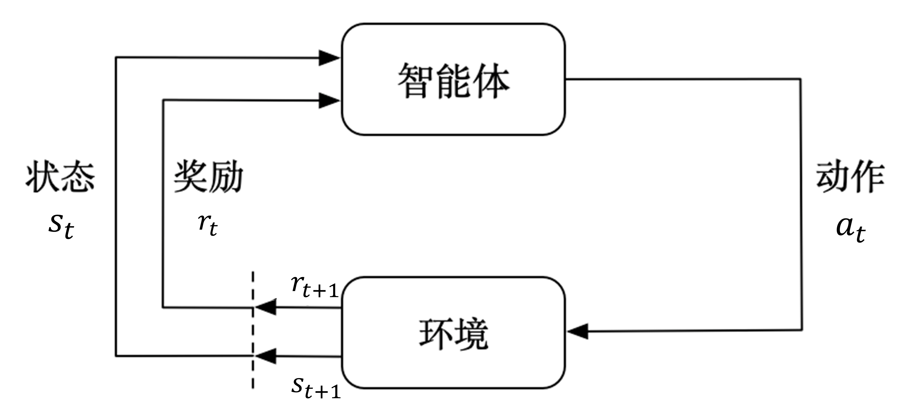
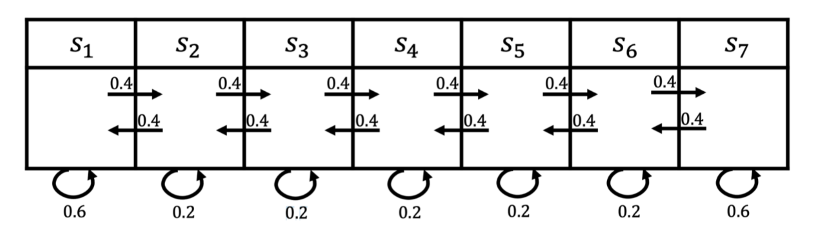

# 马尔可夫决策过程

马尔可夫决策过程 (Markov Decision Process, MDP) 是强化学习中的基本问题模型之一.
- 它的目的是以数学形式来描述 Agent(智能体) 与 environment(环境)交互 中完成目标学习的过程. 即, 用数学形式表述一个学习过层.

智能体与环境交互的马尔可夫决策过程过程如下图所示:

- 图中 t 表示 time step, $t = 1, 2, 3,...$
  > t 与现实时间并不是一一对应的关系, 它描述的是 Agent 进行交互并获得反馈所需要的时间.
- 每个 time step 中, Agent 从 Environment 中观察到一个 state(状态) $s_t$, 并根据当前状态 $s_t$ 和当前奖励 $r_{t}$ 选择并执行一个动作 Action $a_t$.

- 执行动作 $a_t$ 后, Agent 会得到一个 reward(奖励) $r_{t+1}$, 在执行动作 $a_t$ 的过程中, Environment 也会受到影响并进入到下一个状态 $s_{t+1}$.
    > - 我们将$a_t$的奖励记为 $r_{t+1}$ 而不是 $r_t$ 是为了强调获得奖励的时候 time step 已经更新到 t+1 了
    > - Agent 得到的奖励 $r_t$ 在实际情况中可能是一个**随机变量或函数** 而不是一个定值, 有些书籍会将它记为 $R_t$, 这里为了便于概率论相关公式的推导, 暂时用 $r_t$.

此时, 根据这个图, 我们会记录到一系列轨迹:
$$
s_0, a_0, r_1, s_1, a_1, r_2, ..., s_t, a_t, r_{t+1}, ...
$$

我这里重点探讨有限马尔可夫决策过程 (Finite MDP), 因此 t 是有限的, 上限为 T.
- 通常, $[0, T]$ 这个时间范围被称为一个 `episode`(回合). 例如游戏中的一局.
  - T 也是最后一个 time step.
  - 这里的T也被称为 **范围(horizon)**, 也就是指一个回合的长度 (每个回合最大的时间步数). 

这里是对马尔可夫决策过程的一个High-level的简单概括, 下面我们详细分析一些细节.

---

## 马尔可夫性质
马尔科夫性质指的是: `当前时刻的状态 只由 前一个时刻状态决定, 与 更早的历史状态 无关`. 用公式表达为:

$$
P(s_{t+1} | s_t, s_{t-1}, ..., s_0) = P(s_{t+1} | s_t)
$$

对于马尔可夫性质:
- **允许**我们在没有考虑完整的历史经历的情况下, 近依靠最近的一次状态进行预测和控制 Agent 的行为.
- 实际问题中有很多**不满足**马尔科夫性质的例子, 比如棋类游戏, 它需要考虑当前状态以及所有历史状态.
    - 此时我们可以用深度学习神经网络来表示当前的棋局, 并用`蒙特卡洛搜索树`等技术来模拟玩家的策略和未来可能的状态, 来构建一个新的决策模型, 这就是著名的 [AlphaGo](https://www.nature.com/articles/nature16961) 算法.


--- 


# 状态转移矩阵

我们从状态 $s_t$ 转移到任意的下一个状态 $s_{t+1}$ 的可能性是用概率值来描述的, 这个概率就是**状态转移概率**. 如果我们有非常多个状态, 此时我们就可以用一个矩阵来描述状态之间的转移关系, 这个矩阵就是`状态转移矩阵`. 

根据状态是否有限(T是否为有限值), 我们可以将马尔科夫过程的状态转移矩阵的建模分成两种情况:
- 无限状态马尔可夫决策过程 (Infinite MDP)
  - 这个过程又被称为**连续时间马尔可夫决策过程** (Continuous Time MDP), 它允许发生无限次事件, 每个事件发生的机会相对较小, 但当时间趋近于无穷大时, 这些事件以极快的速度发生.
  - 需要使用泊松过程(Poison Process)等方法来描述状态转移概率.

- 有限状态马尔可夫决策过程 (Finite MDP), 这是我们下面主要探讨的场景.


---

# 马尔可夫链 (Markov Chain)
将每一个状态用线或者箭头连接起来, 得到的就是`马尔可夫链`. 马尔可夫链是最简单的马尔科夫过程, 下面会继续提到. 

下图就是一个马尔可夫链(马尔可夫过程)的例子, 它同时也可以用来描述马尔可夫决策过程的**状态流向**:

- 马尔可夫链 也称为 **离散时间的马尔可夫过程(Markov Process)**, 跟马尔可夫决策过程一样, 都需要满足马尔可夫性质. 即当前时刻的状态只与前一个时刻的状态有关, 与更早的历史状态无关.

- 图片中线旁边标注的数字称为 **状态转移概率** (state transition probability), 表示从一个状态转移到另一个状态的概率.
  - 从图中寻找移概率的时候, 我们需要确保 "转入概率" 与 "转出概率" 之和为 1. 
    - 例如 $s_1 → s_1$ 为 0.2, 那么从 $s_1$ 转移出去的概率之和就要为 0.8, 因此可以确定 $s_1 → s_2$ 为 0.4, $s_1 → s_3$ 为 0.4.

- 图中**有箭头的线**表示状态之间转换是有方向的, 线上数字表示的转移概率, 比如从 $s_1$ 转移回到状态 $s_1$ 的概率是 0.2

- 图中**无箭头的线**表示状态之间转换是双向的, 线上数字表示的转移概率(一般), 比如 $s_1$ 和 $s_2$ 之间的转移概率是 0.3


用公式表示状态转移概率为:
$$
P_{ss'} = P(s_{t+1} = s' | s_t = s)
$$
- 从当前状态 $s$ 转移到下一个状态 $s'$ 的概率. $S$ 是状态空间, 包含了所有状态, 即$s, s' \in S$.

由于状态的数量是有限的, 我们可以将这些状态以及转移概率写入一个表格中:

<div align="center">

| state | $s_1$ | $s_2$ | $s_3$ |
| --- | --- | --- | --- | 
| $s_1$ | 0.2 | 0.4 | 0.4 |
| $s_2$ | 0.2 | 0.5 | 0.3 | 
| $s_3$ | 0.1 | 0.3 | 0.6 |

</div>

用矩阵表示的话, 得到:
$$
P_{ss'} = 
\begin{bmatrix}
0.2 & 0.4 & 0.4 \\
0.2 & 0.5 & 0.3 \\
0.1 & 0.3 & 0.6
\end{bmatrix}
$$

如果用符号表示, 则有:
$$
P = \begin{pmatrix}
P_{11} & P_{12} & \cdots  & P_{1n}  \\
P_{21} & P_{22} & \cdots  & P_{2n}  \\
\vdots & \vdots & \ddots  & \vdots  \\
P_{n1} & P_{n2} & \cdots  & P_{nn}
\end{pmatrix}
$$
- 其中, $P_{ij}$ 表示从状态 $s_i$ 转移到状态 $s_j$ 的概率. **所以每一行描述的是从一个节点到达其它所有节点的概率**.
- 注意, 同一状态下, 所有转移到其它状态的概率加起来应等于 1. 也就是每一行加起来应该等于1.

## 马尔可夫过程例子
假设我们有七个状态. 比如从 $s_1$ 开始, 它有0.4的概率到 $s_2$ , 有 0.6 的概率留在当前的状态.  $s_2$ 有 0.4 的概率到$s_1$, 有 0.4 的概率到 $s_3$ , 另外有 0.2 的概率留在当前状态. 用图表示如下:


所以, 在给定状态转移的马尔可夫链后, 我们可以对这个链进行采样, 这样就会得到一串轨迹. 例如, 假设我们从状态 $s_3$ 开始, 可以得到3个轨迹：
* $s_3, s_4, s_5, s_6, s_6$；
* $s_3, s_2, s_3, s_2, s_1$；
* $s_3, s_4, s_4, s_5, s_5$. 

通过对状态的采样, 我们可以生成很多这样的轨迹. 

----

## 奖励 (Reward) 与 回报 (Return)
**奖励函数 R** 是一个`期望`(均值), 它表示当我们达到某个状态后, 可以获得多大的奖励. 
- **当状态有限时, 奖励函数 R 可以是一个向量**.

最开始我们有提到, 有限马尔可夫决策过程的实现目标是在有限的 time step 前提下`让 Agent 的累积奖励最大化`. 这里为了描述方便, 将**第t个time step之后得到的累积奖励**记为`回报 (Return)`, 用 $G_t$ 表示, 写成数学公式如下:
$$
G_t = r_{t+1} + r_{t+2} + ... + r_T
$$
- 此公式仅适用于 `T为有限值` 的场景, 比如玩游戏时, 我们总是在某个步数 (即T) 后以特殊的状态结束游戏.

对于**无限马尔可夫决策过程**, 我们需要引入一个折扣因子 $\gamma$ 来调整回报的计算方式, 也就是`折扣回报 (Discounted Return)`:
$$
G_t = r_{t+1} + \gamma r_{t+2} + \gamma^2 r_{t+3} + ... = \sum_{k=0}^{\infty} \gamma^k r_{t+k+1}
$$
- 其中, $\gamma$ 是一个介于 0 和 1 之间的值, 用来调整未来奖励的重要性.
  - 当 $\gamma = 0$ 时, Agent **只关注当前的奖励**, 不考虑未来奖励.
  - 当 $\gamma = 1$ 时, Agent 会**着重考虑所有未来奖励**.
  - 通常情况下, **越往后得到的奖励, 折扣因子的值会越大**. 因为我们更希望得到现有的奖励, 对未来的奖励要打折扣.


对于 $\gamma$, 我们还有更深层的理解:
> 第一, 有些马尔可夫过程是带环的, 它并不会终结, 我们想避免无穷的奖励. 

> 第二, 我们并不能建立完美的模拟环境的模型, 我们对未来的评估不一定是准确的, 我们不一定完全信任模型, 因为这种不确定性, 所以我们对未来的评估增加一个折扣. 我们想把这个不确定性表示出来, 希望尽可能快地得到奖励, 而不是在未来某一个点得到奖励. 

> 第三, 如果奖励是有实际价值的, 我们可能更希望立刻就得到奖励, 而不是后面再得到奖励(现在的钱比以后的钱更有价值). 

> 最后, 我们也更想得到即时奖励. 有些时候可以让 $\gamma=0$, 我们就只关注当前的奖励. 我们也可以让 $\gamma=1$, 对未来的奖励并没有打折扣, 未来获得的奖励与当前获得的奖励是一样的. 

> 折扣因子可以作为强化学习智能体的一个超参数(hyperparameter)来进行调整, 通过调整折扣因子, 我们可以得到不同动作的智能体. 


引入 $\gamma$ 还可以将当前 time step 的回报与未来 time step 的回报进行关联, 从而更好地指导 Agent 的行为. 也就是说, 我们可以获得下面的递推式:

$$
\begin{aligned}
G_t &= r_{t+1} + \gamma r_{t+2} + \gamma^2 r_{t+3} + \ldots \\
    &= r_{t+1} + \gamma (r_{t+2} + \gamma r_{t+3} + \ldots) \\
    &= r_{t+1} + \gamma G_{t+1}
\end{aligned}
$$

这个公式对于所有 $t<T$ 都成立, 并且在 **贝尔曼公式** 中这个推导式尤其重要.

---

## 价值函数
有了回报的定义, 我们就可以进一步来确定某个状态的价值了, 也就是**状态价值函数(state value function)**.

当我们在马尔可夫过程中引入奖励函数后, 这个过程就可以称为 `马尔可夫奖励过程`, 它是 `马尔可夫决策过程` 的一个子集.

在马尔可夫奖励过程中, 状态价值函数被定义为`回报的期望`, 数学表达式为:

$$
\begin{aligned}
    V^{t}(s) &=\mathbb{E}\left[G_{t} \mid s_{t}=s\right] \\
    &=\mathbb{E}\left[r_{t+1}+\gamma r_{t+2}+\gamma^{2} r_{t+3}+\ldots+\gamma^{T-t-1} r_{T} \mid s_{t}=s\right]
\end{aligned}  
$$
- $G_t$ 是之前定义的**折扣回报(discounted return)**
- 这里的条件期望表达的含义是: 从这个状态开始, 我们在未来可能获得多大的价值. 

### 马尔可夫奖励过程中的价值计算
对于下图的马尔可夫奖励过程, 它的状态是有限的: 


因此它的`奖励函数`其实可以**用一个向量来定义**:
$$
  \boldsymbol{R}=[5,0,0,0,0,0,10]
$$
- 这表示: 智能体进入第一个状态 $s_1$ 的时候会得到 5 的奖励, 进入第七个状态 $s_7$ 的时候会得到 10 的奖励, 进入其他状态都没有奖励. 

假设一个回合有4步, 并且我们已经采样出了3个轨迹, 假设取 $\gamma = 0.5$, 我们可以得到:

  （1）$s_{4}, s_{5}, s_{6}, s_{7} \text{ 的回报}: 0+0.5\times 0+0.25 \times 0+ 0.125\times 10=1.25$

  （2）$s_{4}, s_{3}, s_{2}, s_{1} \text{ 的回报}: 0+0.5 \times 0+0.25\times 0+0.125 \times 5=0.625$

  （3）$s_{4}, s_{5}, s_{6}, s_{6} \text{ 的回报}: 0+0.5\times 0 +0.25 \times 0+0.125 \times 0=0$

这里针对第一个轨迹的计算进行解释:
> 由于奖励函数中规定, 只有进入 $s_1$ 和 $s_5$ 时奖励才不是0, 所以:
>> 在 $s_4$ 这个位置奖励为 0
>> 在 $s_5$ 这个位置奖励为 0, 乘以 $\gamma = 0.5$ , 就是 0.5 * 0
>> 在 $s_6$ 这个位置奖励为 0, 乘以 $\gamma = 0.5^2$ , 就是 0.25 * 0
>> 在 $s_7$ 这个位置奖励为 10, 乘以 $\gamma = 0.5^3$ , 就是 1.25 * 10
>> 此时, 这个轨迹的回报 就是这些奖励都加起来.

由于价值函数是**回报的期望**, 那么当我们有了一些轨迹的实际回报时, 怎么计算它的价值函数呢？比如我们想知道 $s_4$ 的价值, 即当我们进入 $s_4$ 后, 它的价值到底如何？
- 一个可行的做法就是我们**可以生成很多轨迹, 然后把轨迹都叠加起来, 然后将其取平均值**作为我们进入 $s_4$ 的价值. 比如我们可以从 $s_4$ 开始, 采样生成很多轨迹, 把这些轨迹的回报都计算出来, 最后拿回报的平均值作为进入 $s_4$ 的价值. 
  - 这其实是一种计算价值函数的办法, 也就是通过**蒙特卡洛(Monte Carlo, MC)采样**的方法计算 $s_4$ 的价值. 

也有更加复杂的方法, 如使用**贝尔曼方程**来计算某个状态的价值, 这在下一个章节再讲.

---

现在回到我们这里讨论的强化学习, 首先需要重新强调强化学习中的一些概念:
```txt
环境: 
    除了智能体以外, 所有与智能体交互的对象都被称为环境.
    前面提到的 "状态转移概率", "状态转移矩阵" 都属于 "环境" 本身的性质.

状态: 
    指的是 "环境" 的状态.

观测: 
    指的是 "智能体对环境" 的观测, 即智能体从 "环境" 中直接获得的所有信息就是 "观测".

动作: 
    指的是 "智能体" 的动作, 这些动作的执行会影响 "环境" 并产生新的 "状态"
```
- 当我们指定了某个东西为 "智能体" 后, 它就会成为我们关注的对象, 而其他的东西就会被称为 "环境".
  - 在强化学习中, **毕竟交互是相互的, 强化学习中的环境也不是严格意义上的静止环境, 它也可以是其他智能体**. 
  - **有时 智能体 和 环境 的角色是能相互对调的, 只要能各自建模成马尔可夫决策过程即可**

---

明确概念之后, 就需要强调一下:
- **状态转移矩阵属于环境的一部分**, 跟智能体是没什么关系的, 而智能体会根据状态转移矩阵来做出决策. 
- 在 **马尔可夫链(马尔可夫过程)** 的基础上增加 **奖励元素** 就会形成`马尔可夫奖励过程(Markov reward process, MRP)`
- 在 **马尔可夫奖励过程** 基础上增加 **动作的元素** 就会形成`马尔可夫决策过程`, 也就是强化学习的基本问题模型之一.

马尔可夫链 和 马尔可夫奖励过程 在其他领域 例如金融分析 会用的比较多, **强化学习则重在决策**. 


在强化学习中, 我们习惯使用一个 五元组 $<S, A, R, P, \gamma>$ 来表示一个 马尔可夫决策过程.
- 其中 $S$ 表示状态空间, 即所有状态的集合, $A$ 表示动作空间, $R$ 表示奖励函数, $P$ 表示状态转移矩阵, $\gamma$ 表示折扣因子. 

--- 

如果我们进一步细分, 将智能体在与环境交互的过程中获得的所有信息称为`观测(observation)`, **记作$o_t$**. 此时, 针对每一个观测, 智能体会采取一个动作, 也会得到一个奖励. 所以历史 $H_t$ 是观测、动作、奖励的序列：
$$
H_{t}=o_{1},  a_{1}, r_{1}, \ldots, o_{t}, a_{t}, r_{t}
$$

智能体在采取当前动作的时候会依赖于它之前得到的历史, 所以我们可以把整个智能体训练过程中的状态看成关于这个历史的函数：

$$
S_{t}=f\left(H_{t}\right)
$$

那么, 状态和观测有什么关系?
> **状态**是对世界的完整描述, 不会隐藏世界的信息. **观测**是对状态的部分描述, 可能会遗漏一些信息. 
>> 在深度强化学习中(Deep Learning + 传统RL), 我们几乎总是用实值的向量、矩阵或者更高阶的张量来表示状态和观测. 例如, 我们可以用 RGB 像素值的矩阵来表示一个视觉的观测, 可以用机器人关节的角度和速度来表示一个机器人的状态. 

环境有自己的函数来更新`状态`:
$$
s_{t}^{e}=f^{e}\left(H_{t}\right)
$$ 
在智能体的内部也有一个函数来更新`观测`:
$$
o_{t}^{a}=f^{a}\left(H_{t}\right)
$$

当**智能体的观测与环境的状态等价**的时候, 即当智能体能够观察到环境的所有状态时, 我们称这个环境是**完全可观测的 (fully observed)**. 在这种情况下, 强化学习就被建模成前面提到的马尔可夫决策过程问题. 即, 在马尔可夫决策过程中总有
$$
o_{t}=s_{t}^{e}
$$

> 当智能体在决定采取什么动作的时候，符号上的表示按道理来说**动作是基于状态**的，但**实际上，动作是基于观测的**，因为智能体并不能确保自己能知道的信息就是"状态所包含的全部信息"(因为总可能存在观测不到的东西)。

由于有一种情况是**智能体得到的观测并不能包含环境运作的所有状态**, 在这种情况下, 强化学习通常被建模成**部分可观测马尔可夫决策过程(partially observable Markov decision process, POMDP)** 问题. 因为在强化学习的设定里面, 环境的状态才是真正的所有状态. 比如智能体在玩 black jack 游戏, 它能看到的其实是牌面上的牌. 或者在玩雅达利游戏的时候, 观测到的只是当前电视上面这一帧的信息, 我们并没有得到游戏内部里面所有的运作状态. 也就是当智能体只能看到部分的观测, 我们就称这个环境是部分可观测的(partially observed). 
- 部分可观测马尔可夫决策过程是马尔可夫决策过程的一种泛化. 部分可观测马尔可夫决策过程**依然具有马尔可夫性质**, 但是假设智能体无法感知环境的状态, 只能知道部分观测值.

部分可观测马尔可夫决策过程可以用一个**七元组描述**:  $<S,A,T,R,\Omega,O,\gamma>$. 
- 其中 $S$ 表示状态空间, 
- 为隐变量, $A$ 为动作空间, 
- $T(s'|s,a)$ 为状态转移概率, 
- $R$ 为奖励函数, 
- $\Omega(o|s,a)$ 为观测概率, 
- $O$ 为观测空间,
- $\gamma$ 为折扣系数. 

---

# 练习题
1. 强化学习所解决的问题一定要严格满足马尔可夫性质吗？请举例说明. 
```txt
强化学习所解决的问题并不需要严格满足马尔可夫性质, 例如棋类游戏, 它需要考虑所有历史状态, 这并不符合马尔可夫性质, 而且我们已经有强化学习的代表作 AlphaGo, 它就是一个典型的强化学习例子.
```

2. 马尔可夫决策过程主要包含哪些要素？
```txt
一共包含5大要素:
1. 状态集合 S
2. 动作集合 A
3. 奖励函数 R
4. 状态转移矩阵 P
5. 折扣因子 γ
```

3. 马尔可夫决策过程与金融科学中的马尔可夫链有什么区别与联系？
```txt
区别:
    马尔科夫链是一个描述状态之间转移概率的模型, 它只包含状态转移概率, 而马尔可夫决策过程还包含了奖励函数和折扣因子.

联系:
    马尔可夫决策过程是马尔可夫链的一个扩展, 它在马尔可夫链的基础上增加了奖励函数和折扣因子, 用来描述智能体与环境交互的过程.
```
