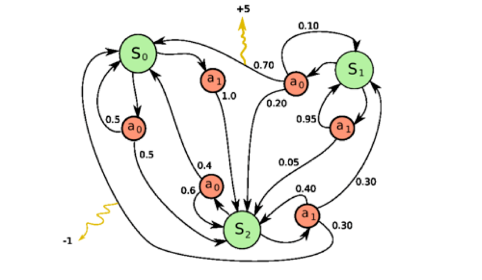
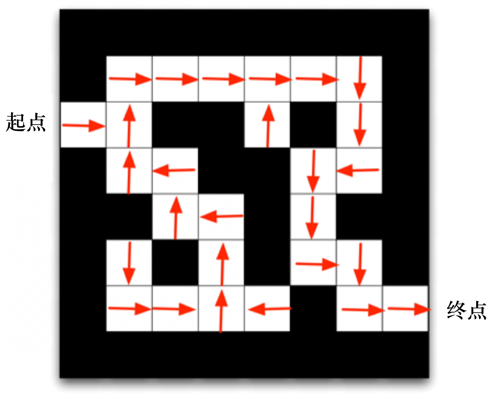
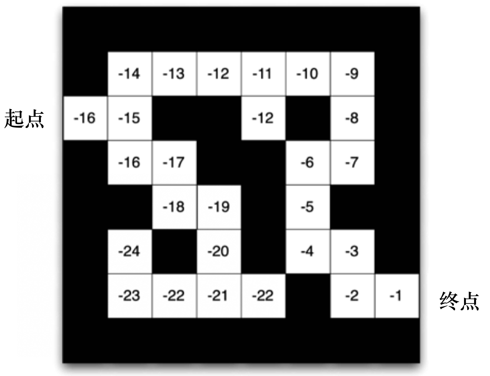
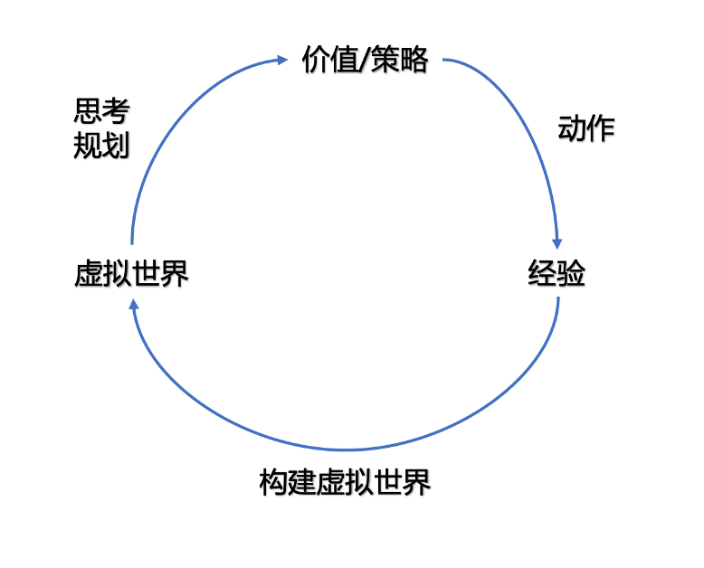
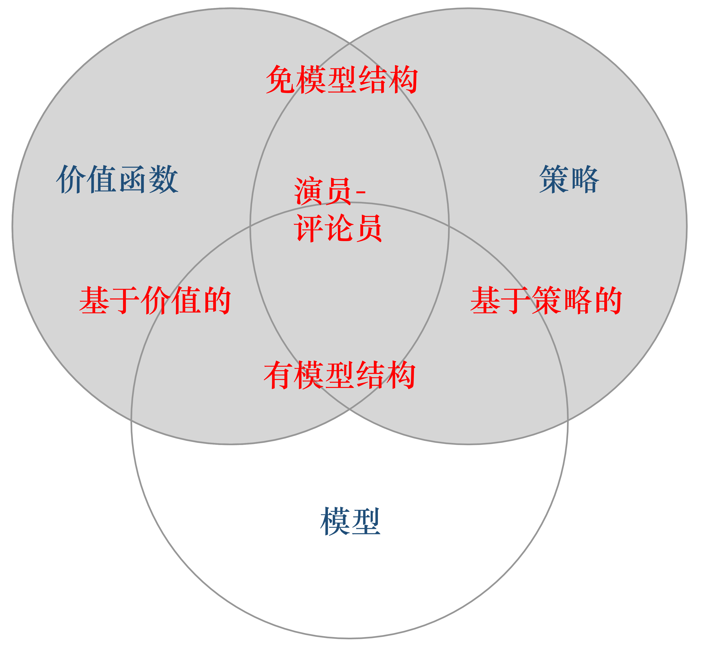

# 什么是强化学习

强化学习是一种机器学习方法, 旨在让智能体学会在一个环境中采取行动以达到某种目标. 它**通过与环境互动来学习最优的行为策略**, 即通过试错和奖励来优化决策过程. 强化学习通常涉及以下要素：

1. **智能体(Agent)**：执行动作并学习的实体, 可以是机器人、程序等. 
2. **环境(Environment)**：智能体所处的外部环境, 对智能体的行动和状态产生影响. 
3. **行动(Action)**：智能体可以采取的操作或决策, 影响环境的变化. 
4. **状态(State)**：描述环境的特定情况或状态, 对智能体的行动和奖励产生影响. 
5. **奖励(Reward)**：智能体根据其行动获得的反馈, 用于评估行为的好坏. 
6. **策略(Policy)**：智能体的决策规则, 用于选择行动以最大化长期奖励. 

在强化学习中, 智能体通过尝试不同的行动, 并根据奖励信号来调整策略, 逐步优化其行为. 这种学习方式特别适用于需要长期决策和试错学习的问题, 例如自动驾驶、游戏策略优化等领域. 

**强化学习是目前最高效的学习方法之一.**

---

## 试错学习
`试错学习(trial and error learning)` 是强化学习最鲜明的要素之一,  它一般包含以下4个特征:
1. 尝试: 首先采取某种行动, 哪怕这个行动是随机行为, 比如模型权重的初始化
2. 错误: 在进行尝试的过程中, 我们总会遇到错误, 这种错误的产生有多种可能, 比如模型的输出结果与 ground truth 之间的差异, 比如环境(如噪声)造成的不确定导致结果与预期存在偏差.
3. 结果: 每次尝试的后果, 无论是积极或者消极, 这个结果都会对下一次的尝试产生直接或间接影响.
4. 学习: 通过多次尝试, 根据结果修正自身行为, 这就是学习的过程.

强化学习除了上述的试错学习之外, 还包含其他的学习形式, 比如`观察学习/模仿学习`等.

## 强化学习里的一些概念

决策 (decision):
- 每一次尝试行为就是一种决策.
- 决策带来的后果可能是即时的, 也可能是长期的(需要等待一段时间后才会触发)

奖励 (reward):
- 尝试所产生的好的结果被称为`奖励`

惩罚 (punishment):
- 尝试所产生的坏的结果被称为`惩罚`
- 惩罚有时也被成为`负的奖励`

序列决策 (sequential decision making):
- 我们通常将通过**多次决策**实现**累积奖励最大化**的过程称为`序列决策` 
- 对于任意问题, 只要能见磨成序列决策问题, 或者带有鲜明的试错学习特征就可以使用强化学习来解决.

---

## 强化学习与监督学习的区别
监督学习(supervised learning)是一种机器学习方法, 通过从标记的训练数据中学习模型, 以预测或分类新数据. 监督学习的目标是学习一个函数, 将输入映射到输出, 以最小化预测误差. 

监督学习过程中, 有两个假设：
  * 输入的数据(标注的数据)都应是没有关联的. 因为如果输入的数据有关联, 学习器(learner)是不好学习的. 
  * 需要告诉学习器正确的标签是什么, 这样它可以通过正确的标签来修正自己的预测. 

> 通常假设样本空间中全体样本服从一个未知分布, 我们获得的每个样本都是独立地从这个分布上采样获得的, 即独立同分布 (independent and identically distributed, 简称 i.i.d.)

在强化学习中, 监督学习的两个假设其实都不能得到满足. 

以雅达利 (Atari)  游戏 Breakout 为例, 如上图所示, 这是一个打砖块的游戏, 控制木板左右移动从而把球反弹到上面来消除砖块. 在玩游戏的过程中, 我们可以发现智能体得到的**观测 (observation) 不是独立同分布的**, 上一帧与下一帧间其实有非常强的连续性. 我们得到的**数据是相关的时间序列数据, 不满足独立同分布**. 
另外, **我们并没有立刻获得反馈**, 游戏没有告诉我们哪个动作是正确动作. 比如现在把木板往右移, 这只会使得球往上或者往左一点儿, 我们并不会得到即时的反馈. 
- 这种特性称为 `延迟奖励 (delayed reward)`

因此, **强化学习之所以困难, 是因为智能体不能得到即时的反馈**, 然而我们依然希望智能体在这个环境中学习. 

总结起来, 强化学习和监督学习的区别如下. 

(1)**强化学习输入的样本是序列数据**, 而不像监督学习里面样本都是独立的. 

(2)**学习器并没有告诉我们每一步正确的动作应该是什么**, 学习器需要自己去发现哪些动作可以带来 最多的奖励, 只能通过不停地尝试来发现最有利的动作. 

(3)**智能体获得自己能力的过程, 其实是不断地试错探索(trial-and-error exploration)的过程**. 
  - 探索 (exploration)和利用(exploitation)是强化学习里面非常核心的问题. 其中, 探索指尝试一些新的动作,  这些新的动作有可能会使我们得到更多的奖励, 也有可能使我们“一无所有”；利用指采取已知的可以获得最多奖励的动作, 重复执行这个动作, 因为我们知道这样做可以获得一定的奖励. 因此, 我们需要在探索和利用之间进行权衡, 这也是在监督学习里面没有的情况. 

(4)**在强化学习过程中, 没有非常强的监督者(supervisor)**, 只有奖励信号(reward signal), 并且奖励信号是延迟的, 即环境会在很久以后告诉我们之前我们采取的动作到底是不是有效的. 因为我们没有得到即时反馈, 所以智能体使用强化学习来学习就非常困难. 当我们采取一个动作后, 如果我们使用监督学习, 我们就可以立刻获得一个指导, 比如, 我们现在采取了一个错误的动作, 正确的动作应该是什么. 而在强化学习里面, 环境可能会告诉我们这个动作是错误的, 但是它并没有告诉我们正确的动作是什么. 而且更困难的是, 它可能是在一两分钟过后告诉我们这个动作是错误的. 所以这也是强化学习和监督学习不同的地方. 

通过与监督学习的比较, 我们可以总结出强化学习的一些特征. 

(1)强化学习会试错探索, 它通过探索环境来获取对环境的理解. 

(2)强化学习智能体会从环境里面获得延迟的奖励. 

(3)在强化学习的训练过程中, 时间非常重要. 因为我们得到的是有时间关联的数据(sequential data),  而不是独立同分布的数据. 在机器学习中, 如果观测数据有非常强的关联, 会使得训练非常不稳定. 这也是为什么在监督学习中, 我们希望数据尽量满足独立同分布, 这样就可以消除数据之间的相关性. 

(4)智能体的动作会影响它随后得到的数据, 这一点是非常重要的. 在训练智能体的过程中, 很多时 候我们也是通过正在学习的智能体与环境交互来得到数据的. 所以如果在训练过程中, 智能体不能保持稳定, 就会使我们采集到的数据非常糟糕. 我们通过数据来训练智能体, 如果数据有问题, 整个训练过程就会失败. **所以在强化学习里面一个非常重要的问题就是, 怎么让智能体的动作一直稳定地提升. **

---

# 强化学习的应用
游戏领域:
- AlphaGo 是围棋AI的代表作, 通过强化学习的方法, 在围棋领域取得了巨大的成功.
- AlphaZero 是一个通用游戏AI.
- AlphaStar 在星际争霸2游戏中取得了巨大的成功.

机器人领域:
- 在机器人中实现强化学习的成本往往较高, 一方面**观测环境的状态需要大量的传感器**, 另一方面则是**试错学习带来的实验成本**, 在训练过程中如果机器人决策稍有失误就有**可能导致设备损坏**, 因此在实际应用中往往需要结合其他的方法来辅助强化学习进行决策.
  - 通常会使用仿真环境进行模拟. Visual Language Navigation (VLN) 就是一个典型的例子.
- NICO 机器人学习抓取物体就是强化学习在机器人中应用的经典例子.

领域很多, 不再一一列举.

---

## 强化学习智能体的组成成分和类型
对于一个强化学习智能体, 它可能有一个或多个如下的组成成分. 

* **策略(policy)**. 智能体会用策略来选取下一步的动作. 

* **价值函数(value function)**. 我们用价值函数来对当前状态进行评估. 价值函数用于评估智能体进 入某个状态后, 可以对后面的奖励带来多大的影响. 价值函数值越大, 说明智能体进入这个状态越有利. 

* **模型(model)**. 模型表示智能体对环境的状态进行理解, 它决定了系统是如何运行的.  

下面我们深入了解这 3 个组成部分的细节. 

### 策略
**策略是智能体的动作模型, 它决定了智能体的动作.** 它其实是一个函数, 用于把输入的状态变成动作. 策略可分为两种：
  > 随机性策略 和 确定性策略. 

**随机性策略(stochastic policy)** 就是 $\pi$ 函数, 即
$$\pi(a | s)=p\left(a_{t}=a | s_{t}=s\right)
$$
- 输入一个状态 $s$, 输出一个概率.  
- 这个概率是智能体关于所有动作的概率, 然后对这个概率分布进行采样, 可得到智能体将采取的动作. 比如可能是有 0.7 的概率往左, 0.3 的概率往右, 那么通过采样就可以得到智能体将采取的动作. 

**确定性策略(deterministic policy)** 就是智能体直接采取最有可能的动作, 即 
$$a^{*}=\underset{a}{\arg \max} \pi(a \mid s)
$$  

通常情况下, **强化学习一般使用随机性策略**, 随机性策略有很多优点. 
- 比如, 在学习时可以通过引入一定的随机性来更好地探索环境;
- 随机性策略的动作具有多样性, 这一点在多个智能体博弈时非常重要. 

采用**确定性策略**的智能体总是对同样的状态采取相同的动作, 这会导致它的**策略很容易被对手预测**. 

### 价值函数
**价值函数的值是对未来奖励的预测, 我们用它来评估状态的好坏.**

价值函数里面有一个**折扣因子(discount factor)**, 我们希望在尽可能短的时间里面得到尽可能多的奖励. 比如现在给我们两个选择：10天后给我们100块钱或者现在给我们100块钱. 我们肯定更希望现在就给我们 100 块钱, 因为我们可以把这 100 块钱存在银行里面, 这样就会有一些利息. 因此, 我们可以把折扣因子放到价值函数的定义里面, 价值函数的定义为

$$
\begin{aligned}
V_{\pi}(s) &\doteq \mathbb{E}_{\pi}\left[G_{t} \mid s_{t}
= s\right] \\
&= \mathbb{E}_{\pi}\left[\sum_{k=0}^{\infty} \gamma^{k} r_{t+k+1} \mid s_{t}=s\right], \space \space s \in S
\end{aligned}
$$
- 期望 $\mathbb{E}_{\pi}$ 的下标是 $\pi$ 函数, $\pi$ 函数的值可反映在我们使用策略 $\pi$ 的时候, 到底可以得到多少奖励. 

我们还有一种价值函数 -- `Q 函数`. 里面包含两个变量：`状态` 和 `动作`. 其定义为:
$$
\begin{aligned}
Q_{\pi}(s, a) &\doteq \mathbb{E}_{\pi}\left[G_{t} \mid s_{t}=s, a_{t}=a\right] \\
&= \mathbb{E}_{\pi}\left[\sum_{k=0}^{\infty} \gamma^{k} r_{t+k+1} \mid s_{t}=s, a_{t}=a\right]
\end{aligned}
$$
- 所以我们未来可以获得奖励的期望取决于当前的状态和当前的动作. 

**Q 函数是强化学习算法里面要学习的一个函数**. 
> 因为当我们得到 Q 函数后, 进入某个状态要采取的`最优动作可以通过 Q 函数得到`. 

### 模型 
第3个组成部分是模型, **模型用于决定下一步的状态**. 
**下一步的状态取决于 当前的状态 以及 当前采取的动作**. 从数学描的角度, 我们可以用 "状态转移概率" 和 "奖励函数" 来表述下一个 time step 的状态. 
- 模型一般指的是能描述 "环境转移" 的概率模型, 也就是对状态转移概率进行建模.

状态转移概率用数学公式表示为:
$$
p_{s s^{\prime}}^{a}=p\left(s_{t+1}=s^{\prime} \mid s_{t}=s, a_{t}=a\right)
$$

奖励函数则是指我们在当前状态采取了某个动作后, 可以得到多大的奖励, 用数学公式表示为:
$$
R(s,a)=\mathbb{E}\left[r_{t+1} \mid s_{t}=s, a_{t}=a\right]
$$
当我们有了策略、价值函数和模型3个组成部分后, 就形成了一个**马尔可夫决策过程(Markov decision process)**. 这将在第二章里着重介绍.

下图是马尔可夫决策过程, 它可视化了状态之间的转移以及采取的动作. 

---

### 智能体的类型
根据智能体学习的事物不同, 我们可以把智能体进行归类. 
- **基于价值的智能体(value-based agent)** 显式地学习价值函数, 隐式地学习它的策略. 
  > 策略是其从学到的价值函数里面推算出来的. 
- **基于策略的智能体(policy-based agent)** 直接学习策略, 我们给它一个状态, 它就会输出对应动作的概率. 
  > 基于策略的智能体并没有学习价值函数. 
- 把基于价值的智能体和基于策略的智能体结合起来就有了**演员-评论员智能体(actor-critic agent)**. 
  > 这一类智能体把策略和价值函数都学习了, 然后通过两者的交互得到最佳的动作. 

--- 

#### "走迷宫"例子
如下图, 我们要求智能体从起点（start）开始, 然后到达终点（goal）的位置. 
- 每走一步, 我们就会得到 $-$1 的奖励. 我们可以采取的动作是往上、下、左、右走. 
- 我们用现在智能体所在的位置来描述当前状态. 

如下图所示, 如果我们采取**基于策略**的强化学习（policy-based RL）方法, 当学习好了这个环境后, 在每一个状态, 我们都会得到一个最佳的动作.
- 比如我们现在在起点位置, 我们知道最佳动作是往右走；
- 在第二格的时候, 得到的最佳动作是往上走；
- 第三格是往右走......通过最佳的策略, 我们可以最快地到达终点. 

如果换成**基于价值**的强化学习（value-based RL）方法, 利用价值函数作为导向, 我们就会得到另外一种表征, 每一个状态会返回一个价值:
- 比如我们在起点位置的时候, 价值是 $-16$, 因为我们最快可以 16 步到达终点. 因为每走一步会减1, 所以这里的价值是 $-16$
- 当我们快接近终点的时候, 这个数字变得越来越大. 在拐角的时候, 比如现在在第二格, 价值是$-15$, 智能体会看上、下两格, 它看到上面格子的价值变大了, 变成 $-14$ 了, 下面格子的价值是 $-16$, 那么智能体就会采取一个往上走的动作. 
- 所以通过学习的价值的不同, 我们可以抽取出现在最佳的策略.

----

#### 基于策略和基于价值的强化学习方法的区别
对于一个状态转移概率已知的马尔可夫决策过程, 我们可以使用**动态规划算法来求解**. 
正如上面提到的, 如果从决策方式来看, 强化学习可以划分为基于策略的方法和基于价值的方法. **决策方式是智能体在给定状态下从动作集合中选择一个动作的依据, 它是静态的, 不随状态变化而变化**. 
> 在基于**策略**的强化学习方法中, 智能体会**制定一套动作策略**(确定在给定状态下需要采取何种动作), 并根据这个策略进行操作. 强化学习算法直接对策略进行优化, 使制定的策略能够获得最大的奖励. 
> 而在基于**价值**的强化学习方法中, 智能体不需要制定显式的策略, 它**维护一个价值表格或价值函数**, 并通过这个价值表格或价值函数来选取价值最大的动作. 
>> 基于策略的强化学习算法有策略梯度(Policy Gradient, PG)算法等. 

> **基于价值迭代的方法只能应用在不连续的、离散的环境下**(如围棋或某些游戏领域), 
> 对于动作集合规模庞大、动作连续的场景(如机器人控制领域), 其很难学习到较好的结果, 但此时基于策略迭代的方法能够根据设定的策略来选择连续的动作. 
>> 基于价值的强化学习算法有Q学习(Q-learning)、 Sarsa 等, 

> 此外, 演员-评论员算法**同时使用策略和价值评估来做出决策**. 
> 其中, 智能体会根据策略做出动作, 而价值函数会对做出的动作给出价值, 这样可以在原有的策略梯度算法的基础上加速学习过程, 取得更好的效果. 

--- 

#### 有模型强化学习智能体与免模型强化学习智能体

除了根据决策方式划分, 我们还可以通过**智能体到底有没有学习环境模型**来对智能体进行分类. 

- **有模型（model-based）** 
  - 强化学习智能体通过**学习状态的转移**来采取动作.  
- **免模型（model-free）** 
  - 强化学习智能体没有去直接估计状态的转移, 也没有得到环境的具体转移变量, 它通过**学习价值函数和策略函数**进行决策. **免模型强化学习智能体的模型里面没有环境转移的模型**. 

对于有模型强化学习: 
- 我们可以用马尔可夫决策过程来定义强化学习任务, 并将其表示为四元组 $<S,A,P,R>$, 即状态集合、动作集合、状态转移函数和奖励函数. 如果这个四元组中所有元素均已知, 且状态集合和动作集合在有限步数内是有限集, 则智能体可以对真实环境进行建模, 构建一个虚拟世界来模拟真实环境中的状态和交互反应. 具体来说, 当智能体知道状态转移函数 $P(s_{t+1}|s_t,a_t)$ 和奖励函数 $R(s_t,a_t)$ 后, 它就能知道在某一状态下执行某一动作后能带来的奖励和环境的下一状态, 这样**智能体就不需要在真实环境中采取动作, 直接在虚拟世界中学习和规划策略即可**. 其流程如下:

对于免模型强化学习:
- 在实际应用中, 智能体并不是那么容易就能知晓马尔可夫决策过程中的所有元素的. 通常情况下, 状态转移函数和奖励函数很难估计, 甚至连环境中的状态都可能是未知的, 这时就需要采用免模型强化学习. 
- **免模型强化学习没有对真实环境进行建模, 智能体只能在真实环境中通过一定的策略来执行动作**, 等待奖励和状态迁移, 然后根据这些反馈信息来更新动作策略, 这样反复迭代直到学习到最优策略. 

#### 有模型和免模型的区别
有模型智能体可以在虚拟世界中学习, 而免模型智能体只能在真实环境中学习. 有模型强化学习相比免模型强化学习仅仅多出一个步骤, 即对真实环境进行建模.
> 如果不清楚该用有模型强化学习还是免模型强化学习, 可以先思考**在智能体执行动作前, 是否能对下一步的状态和奖励进行预测, 如果能, 就能够对环境进行建模, 从而采用有模型学习**.

> **免模型强化学习通常属于数据驱动型方法**, 需要大量的采样来估计状态、动作及奖励函数, 从而优化动作策略. 
> **有模型**的深度强化学习可以在一定程度上**缓解训练数据匮乏的问题**, 因为智能体可以在虚拟世界中进行训练.

> **免模型学习的泛化性要优于有模型强化学习**, 原因是有模型强化学习算需要对真实环境进行建模, 并且虚拟世界与真实环境之间可能还有差异, 这限制了有模型强化学习算法的泛化性. 

> 有模型的强化学习方法可以对环境建模, 使得该类方法具有独特魅力, 即“想象能力”. 
> 在免模型强化学习中, 智能体只能一步一步地采取策略, 等待真实环境的反馈；
> 有模型强化学习可以在虚拟世界中预测出将要发生的事, 并采取对自己最有利的策略. 

> 目前, 大部分深度强化学习方法都采用了**免模型强化学习**, 这是因为：
>> 免模型强化学习更为简单、直观且有丰富的开源资料.
>> 在目前的强化学习研究中, 大部分情况下环境都是静态的、可描述的, 智能体的状态是离散的、可观察的(如雅达利游戏平台), 这种相对简单、确定的问题并不需要评估状态转移函数和奖励函数, 可直接采用免模型强化学习, 使用大量的样本进行训练就能获得较好的效果.

---

# 强化学习研究方向
多智能体强化学习 (multi-agent reinforcement learning, MARL):
- 意思是在多个智能体的环境下进行强化学习.
- 存在的问题:
  - 多个智能体之间如何高效通信.
  - 如何协作, 协作时的贡献或责任怎么界定.
  - 复杂博弈场景怎么进行均衡.

从数据中学习, 或者从演示中学习 (learn from demostration):
- 在模仿学习中, 如何通过从专家数据中学习策略
  - 模仿学习是指奖励函数难以明确定义或者策略本身就很难学出来的情况下, 我们可以通过模仿人类的行为来学习到一个较好的策略.
    - 经典模仿策略之一就是`行为克隆(behavior cloning, BC)`, 通过监督学习的方法(比如训练神经网络)来学习策略. 这种方法的缺点是容易受到 数据分布漂移(data distribution shift) 的影响. 此时智能体会遇到从未见过的状态, 导致策略失效.
- 在逆强化学习 (inverse reinforcement learning, IRL) 中, 如何从人类数据中**学习奖励函数**.
  - 逆强化学习会受到噪声的影响, 因此如何从噪声数据中学习到一个较好的奖励函数也是一个难题. 
-  RLHF (Reinforcement Learning from Human Feedback) 如何从人类的反馈中学习**奖励模型**来进行微调 (fine-tune).
- 离线强化学习 (offline reinforcement learning) 如何从历史数据中学习策略.
- 世界模型 (world model)
  - 在离线环境中训练一个世界模型, 然后将世界模型部署到在线环境中进行决策. 世界模型的思路是将环境分为两个部分, 一个是世界模型, 另一个是控制器. 世界模型的作用是预测下一个状态, 而控制器的作用是根据当前的状态来决策动作. 
  - 难题: 
    - 世界模型的预测误差会导致控制器的决策出错, 因此如何提高世界模型的预测精度也是一个难题. 

探索策略 (exploration strategy):
- 如何在探索和利用之间取得平衡. 
  - 在探索的过程中, 智能体会尝试一些未知的动作, 从而可能会获得更多的奖励, 但同时也可能会遭受到惩罚. 而在利用的过程中, 智能体会选择已知的动作, 从而可能会获得较少的奖励, 但同时也可能会遭受较少的惩罚.
  - 比较常用的方法有 `ε-greedy`, `UCB (upper confidence bound)`, `Thompson Sampling` 等.
  - 提高探索的本质也是为了**避免局部最优**问题, 从而提高智能体的鲁棒性, 近年来也有研究结合进化算法来提高探索的效率, 如 `NEAT (neuro evolution of augmenting topologies)`, `PBT(population-based training)` 等.
    - 这些算法增加计算成本.

实时环境 (real-time environment):
- 一种是研究世界模型
- 一种是研究离线环境下的强化学习

多任务强化学习 (multi-task reinforcement learning):
- 智能体往往需要同时解决多个任务, 例如机器人需要同时完成抓取、搬运、放置等任务, 而不是单一的抓取任务. 在这种情况下, 如何在多个任务之间做出权衡是一个难题. 
  - 常见的训练方法是 `联合训练 (join training)` 和 `分层强化学习 (hierarchical reinforcement learning)`
    - 联合训练的思路是**将多个任务的奖励进行加权求和**, 然后通过强化学习来学习一个策略. 
    - 分层强化学习的思路是将多个任务分为两个层次, 一个是**高层策略**, 另一个是**低层策略**. 高层策略的作用是决策当前的任务, 而低层策略的作用是决策当前任务的动作. 这样就可以通过强化学习来学习高层策略和低层策略, 从而解决多任务强化学习的问题. 
      - 存在问题: 
        - 高层策略的决策可能会导致低层策略的决策出错, 因此如何提高高层策略的决策精度也是一个难题.

---

本章的关键概念总结以及面试问答参见 [questions&keywords](chapter1_questions&keywords.md).
