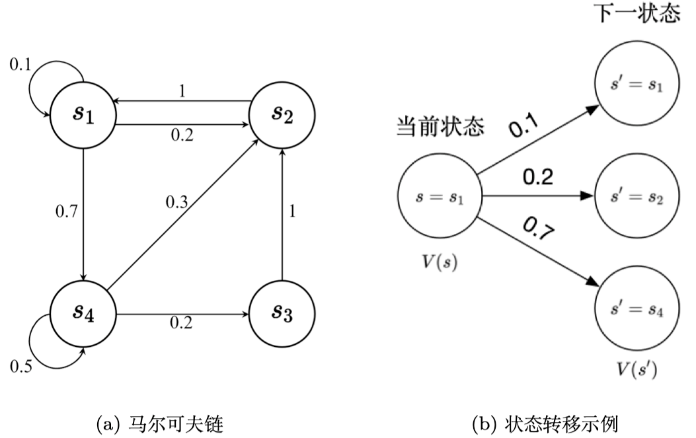
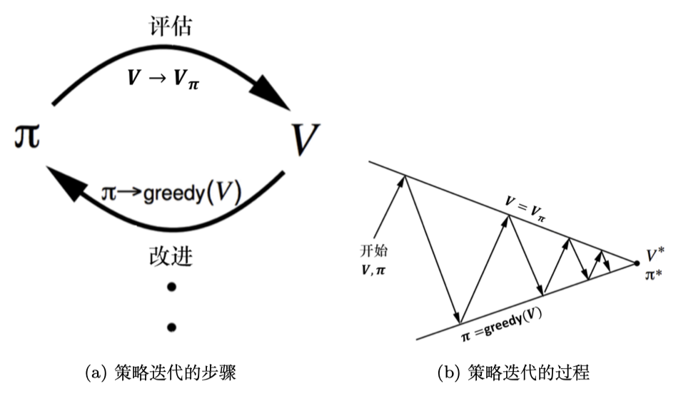
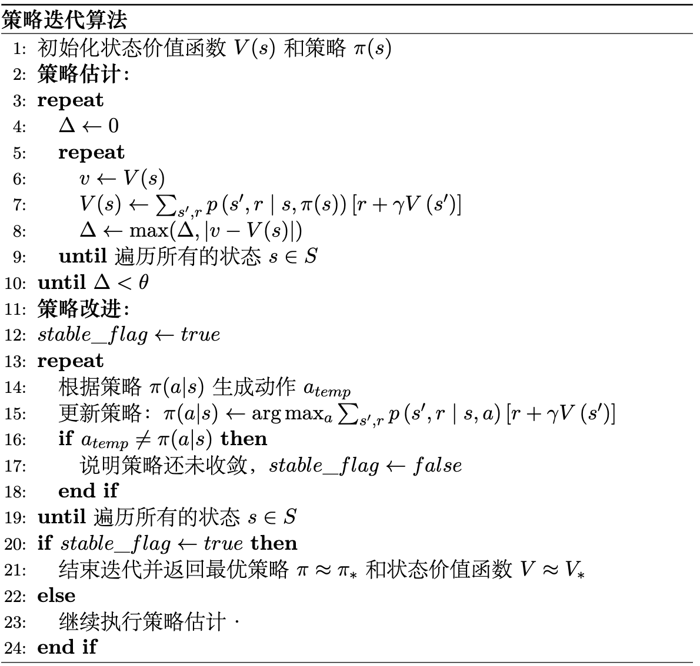
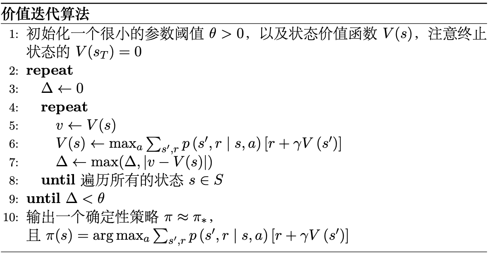
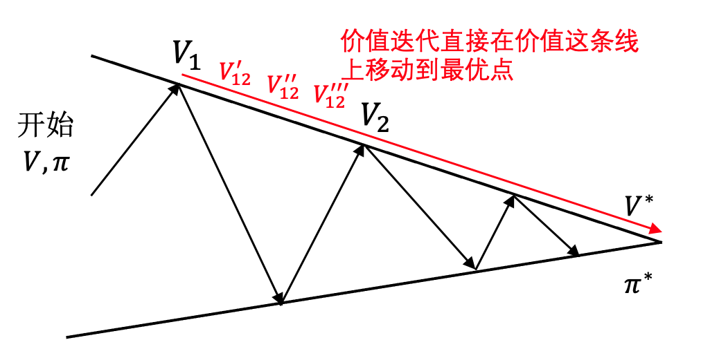

# 动态规划

动态规划(dunamic programming, DP) 是强化学习中最基础的算法之一. 动态规划具体指的是在某些复杂问题中, 将问题转化为若干个子问题, 并在求解每个子问题的过程中保存已经求解的结果, 以便后续使用。实际上动态规划更像是一种通用的思路, 而不是具体某个算法。

在强化学习中, 动态规划被用于`求解值函数和最优策略`. 常见的动态规划算法有:
- 值迭代(Value Iteration, VI)
- 策略迭代 (policy iteration, PI)
- Q-learning 

为什么动态规划能解决强化学习问题呢? 首先, 动态规划有三个性质:
1. 最优化原理
2. 无后效应
3. 有重叠子问题

其中:
- 有重叠字问题不是动态规划问题的必要条件, 这里就略过了. 

- 对于无后效应, 它指的是某一阶段的状态一旦确定, 就不会受到这个状态以后的决策所影响. 即状态 $s_t$ 不会受到未来状态 $s_{t+i}$ 的影响, 而至于当前状态有关 (其实就是马尔可夫性质).

- 最优化原理指的是, 如果 "问题的最优解" 所包含的 "子问题的解也是最优的", 就称这个问题具有**最优子结构**, 即满足最优化原理.

回忆前一章讲的马尔可夫决策过程, 它的目标是最大化累积回报, 我们还得到了一个递推式:
$$G_t = R_{t+1} + \gamma G_{t+1}$$
- 公式表明当前 time step 的回报与下一个 time step 的回报有关.
> 换句话说, 我们可以在不同时步上通过某种方法最大化对应时步的回报来解决马尔可夫决策问题，我们要解决 $G_{t+1}$ 问题, 可以拆解为求解 $G_{t}, G_{t-1}, \cdots ,G_1$ 的问题. 这说明**满足动态规划性质中的最优化原理**条件.
> 又因为这个问题本就具有马尔可夫性质, 所以也**满足无后效应**.

所以, 马尔可夫决策过程问题可以用动态规划的思想来解决.

--- 

# 贝尔曼方程

## 动作价值函数
在前面章节中已经提到过, 马尔可夫决策过程中, 每一个状态都是有一定价值的, 其价值定义为:
$$
\begin{aligned}
V_{\pi}(s) &= \mathbb{E}_{\pi} [R_t + \gamma R_{t+1} + \gamma^2 R_{t+2} + \cdots | S_t = s ] \\
    &= \mathbb{E}_{\pi} [G_t | S_t = s]
\end{aligned}
$$
- 公式表示: 从特定状态 $s$ 出发, 按照**某种策略** $\pi$ 进行决策所能得到的**回报期望值**(回报的平均值). 注意这里的平均回报是**折扣回报** (带有 $\gamma$ ).

此外, 引入动作元素后, 会附带产生一个 `Q函数`, 也称为`动作价值函数(action-value function)`, 定义为:
$$
\begin{aligned}
Q_{\pi}(s, a) &= \mathbb{E}_{\pi} [R_t + \gamma R_{t+1} + \gamma^2 R_{t+2} + \cdots | S_t = s, A_t = a ] \\
    &= \mathbb{E}_{\pi} [G_t | S_t = s, A_t = a]
\end{aligned}
$$

据此, 我们还能写出 状态价值函数 与 动作价值函数 之间的关系:
$$
V_{\pi}(s) = \sum_{a \in A} \pi(a|s) Q_{\pi}(s, a)
$$
- 式中, $\pi(a|s)$ 表示策略函数, 即在状态 $s$ 下, 选择动作 $a$ 的概率分布.
- 整个公式表示: 在**给定的环境状态s的情况下**, 当前状态的价值等于**智能体所有动作的价值期望** (所有动作价值函数乘以对应动作的概率, 求和), 公式里的期望计算方法就是数学中的**全期望公式**.

---

### 全期望公式&定理

对于全期望公式, 我们可以给出更详细的定义:
> 如果 $A_i$ 是样本空间的有限或可数的划分（partition），则全期望公式可定义为
$$
  \mathbb{E}[X]=\sum_{i} \mathbb{E}\left[X \mid A_{i}\right] p\left(A_{i}\right)
$$
- 全期望公式也被称为叠期望公式（law of iterated expectations，LIE）

证明：
为了符号简洁并且易读，我们去掉下标，令 $s=s_t$，$g'=G_{t}$，$s'=s_{t}$。我们可以根据条件期望的定义来重写回报的期望为

$$
  \begin{aligned}
    \mathbb{E}\left[G_{t} \mid s_{t}\right] &=\mathbb{E}\left[g^{\prime} \mid s^{\prime}\right] \\
    &=\sum_{g^{\prime}} g^{\prime}~p\left(g^{\prime} \mid s^{\prime}\right)
    \end{aligned} 
$$

>使用一个定理: 如果 $X$ 和 $Y$ 都是离散型随机变量，则条件期望（conditional expectation）$\mathbb{E}[X|Y=y]$ 定义为
$$
  \mathbb{E}[X \mid Y=y]=\sum_{x} x p(X=x \mid Y=y)
$$

令 $s_t=s$，我们对上式求期望可得
$$
  \begin{aligned}
    \mathbb{E}\left[\mathbb{E}\left[G_{t} \mid s_{t}\right] \mid s_{t}\right] &=\mathbb{E} \left[\mathbb{E}\left[g^{\prime} \mid s^{\prime}\right] \mid s\right] \\
    &=\mathbb{E} \left[\sum_{g^{\prime}} g^{\prime}~p\left(g^{\prime} \mid s^{\prime}\right)\mid s\right]\\
    &=\sum_{s^{\prime}} \sum_{g^{\prime}} g^{\prime} p\left(g^{\prime} \mid s^{\prime}, s\right) p\left(s^{\prime} \mid s\right) \\
    &=\sum_{s^{\prime}} \sum_{g^{\prime}} \frac{g^{\prime} p\left(g^{\prime} \mid s^{\prime}, s\right) p\left(s^{\prime} \mid s\right) p(s)}{p(s)} \\
    &=\sum_{s^{\prime}} \sum_{g^{\prime}} \frac{g^{\prime} p\left(g^{\prime} \mid s^{\prime}, s\right) p\left(s^{\prime}, s\right)}{p(s)} \\
    &=\sum_{s^{\prime}} \sum_{g^{\prime}} \frac{g^{\prime} p\left(g^{\prime}, s^{\prime}, s\right)}{p(s)} \\
    &=\sum_{s^{\prime}} \sum_{g^{\prime}} g^{\prime} p\left(g^{\prime}, s^{\prime} \mid s\right) \\
    &=\sum_{g^{\prime}} \sum_{s^{\prime}} g^{\prime} p\left(g^{\prime}, s^{\prime} \mid s\right) \\
    &=\sum_{g^{\prime}} g^{\prime} p\left(g^{\prime} \mid s\right) \\
    &=\mathbb{E}\left[g^{\prime} \mid s\right]=\mathbb{E}\left[G_{t} \mid s_{t}\right]
    \end{aligned}    
$$

因此, 我们得出了下面的**定理**:
$$
  \mathbb{E}[V(s_{t})|s_t]=\mathbb{E}[\mathbb{E}[G_{t}|s_{t}]|s_t]=\mathbb{E}[G_{t}|s_t]
$$

---

## 贝尔曼方程推导
对于价值函数 $V(s)$, 我们可以进行如下推导:
$$
  V(s)=\underbrace{R(s)}_{\text {即时奖励}}+\underbrace{\gamma \sum_{s^{\prime} \in S} p\left(s^{\prime} \mid s\right) V\left(s^{\prime}\right)}_{\text {未来奖励的折扣总和}}
$$
其中:
* $s'$ 可以看成未来的所有状态，
* $p(s'|s)$  是指从当前状态转移到未来状态的概率。
* $V(s')$ 代表的是未来某一个状态的价值。我们从当前状态开始，有一定的概率去到未来的所有状态，所以我们要把 $p\left(s^{\prime} \mid s\right)$ 写上去。我们得到了未来状态后，乘一个 $\gamma$，这样就可以把未来的奖励打折扣。
* $\gamma \sum_{s^{\prime} \in S} p\left(s^{\prime} \mid s\right) V\left(s^{\prime}\right)$ 可以看成未来奖励的折扣总和（discounted sum of future reward）。

贝尔曼方程定义了当前状态与未来状态之间的关系。 **即时奖励加上未来奖励的折扣总和，就组成了贝尔曼方程 (Bellman Equation)**。

结合前面全期望公式中得到的定理, 我们可以得到如下过程：
$$
  \begin{aligned}
    V(s)&=\mathbb{E}\left[G_{t} \mid s_{t}=s\right]\\
    &=\mathbb{E}\left[r_{t+1}+\gamma r_{t+2}+\gamma^{2} r_{t+3}+\ldots \mid s_{t}=s\right]  \\
    &=\mathbb{E}\left[r_{t+1}|s_t=s\right] +\gamma \mathbb{E}\left[r_{t+2}+\gamma r_{t+3}+\gamma^{2} r_{t+4}+\ldots \mid s_{t}=s\right]\\
    &=R(s)+\gamma \mathbb{E}[G_{t+1}|s_t=s] \\
    &=R(s)+\gamma \mathbb{E}[V(s_{t+1})|s_t=s]\\
    &=R(s)+\gamma \sum_{s^{\prime} \in S} p\left(s^{\prime} \mid s\right) V\left(s^{\prime}\right)
    \end{aligned}  
$$
这就是贝尔曼方程的证明过程.
>贝尔曼方程就是当前状态与未来状态的迭代关系，表示当**前状态的价值函数**可以通过**下个状态的价值函数**来计算。贝尔曼方程因其提出者、动态规划创始人理查德 $\cdot$ 贝尔曼（Richard Bellman）而得名 ，也叫作“动态规划方程”。

贝尔曼方程的重要意义就在于前面所说的**满足动态规划的最优化原理**，即将前后两个状态之间联系起来，以便于递归地解决问题。

到这里, 我们推导了状态价值函数$V(s)$的贝尔曼方程, 类似地, 对于动作价值函数 $Q_{\pi}$ 我们也可以推导出 $Q_{\pi}$ 的贝尔曼方程:
$$
Q_{\pi} = R(s, a) + \gamma \sum_{s^{\prime} \in S} p(s^{\prime} | s, a) \sum_{a^{\prime} \in A} \pi(a^{\prime} | s^{\prime}) Q_{\pi}(s^{\prime}, a^{\prime})
$$

前面我们提到状态价值函数的定义就是按照某种策略 $\pi$ 进行决策得到的累积回报期望，换句话说，在最优策略下，状态价值函数也是最优的，相应的动作价值函数也最优.

在强化学习中, 我们的目标是使得累积的回报最大化，那么最优策略下的**状态价值函数**可以表示为:
$$
\begin{aligned}
V_{*}(s) &= \max_{a} \mathbb{E}[R_{t+1} + \gamma V_{*}(s_{t+1}) | S_t = s, A_t = a] \\
 &= \max_{a} \sum_{s^{\prime},r} p(s^{\prime},r | s, a) [r + \gamma V_{*}(s^{\prime})]
\end{aligned}
$$
- 这个公式叫做贝尔曼最优方程（Bellman optimality equation）

同样地, 对于**动作价值函数**, 也有:
$$
\begin{aligned}
Q^{*}(s, a) &= \mathbb{E}[R_{t+1} + \gamma \max_{a^{\prime}} Q^{*}(s_{t+1}, a^{\prime}) | S_t = s, A_t = a] \\
 &=  \sum_{s^{\prime},r} p(s^{\prime},r | s, a) [r + \gamma \max_{a^{\prime}} Q^{*}(s^{\prime}, a^{\prime})]
\end{aligned}
$$

---

### 贝尔曼方程在马尔可夫链中的使用
假设我们有下图的马尔可夫链:

- 在这个例子里, 贝尔曼方程描述的就是**当前状态到未来状态的一个转移**.

假设我们当前在 $s_1$， 那么它只可能去到3个未来的状态：
- 有 0.1 的概率留在它当前位置，
- 有 0.2 的概率去到 $s_2$ 状态，
- 有 0.7 的概率去到 $s_4$ 状态。

所以我们把状态转移概率乘它未来的状态的价值，再加上它的即时奖励（immediate reward），就会得到它当前状态的价值。贝尔曼方程定义的就是当前状态与未来状态的迭代关系.

我们可以把贝尔曼方程写成矩阵的形式：
$$
  \left(\begin{array}{c}
    V\left(s_{1}\right) \\
    V\left(s_{2}\right) \\
    \vdots \\
    V\left(s_{N}\right)
    \end{array}\right)=\left(\begin{array}{c}
    R\left(s_{1}\right) \\
    R\left(s_{2}\right) \\
    \vdots \\
    R\left(s_{N}\right)
    \end{array}\right)+\gamma\left(\begin{array}{cccc}
    p\left(s_{1} \mid s_{1}\right) & p\left(s_{2} \mid s_{1}\right) & \ldots & p\left(s_{N} \mid s_{1}\right) \\
    p\left(s_{1} \mid s_{2}\right) & p\left(s_{2} \mid s_{2}\right) & \ldots & p\left(s_{N} \mid s_{2}\right) \\
    \vdots & \vdots & \ddots & \vdots \\
    p\left(s_{1} \mid s_{N}\right) & p\left(s_{2} \mid s_{N}\right) & \ldots & p\left(s_{N} \mid s_{N}\right)
    \end{array}\right)\left(\begin{array}{c}
    V\left(s_{1}\right) \\
    V\left(s_{2}\right) \\
    \vdots \\
    V\left(s_{N}\right)
    \end{array}\right) 
$$

- 我们当前的状态是向量$[V(s_1),V(s_2),\cdots,V(s_N)]^\mathrm{T}$。
- 每一行来看，向量$\boldsymbol{V}$乘状态转移矩阵里面的某一行，再加上它当前可以得到的奖励，就会得到它当前的价值。

当我们把贝尔曼方程写成矩阵形式后，可以直接求解：
$$
  \begin{aligned}
    \boldsymbol{V} &= \boldsymbol{\boldsymbol{R}}+ \gamma \boldsymbol{P}\boldsymbol{V} \\
    \boldsymbol{I}\boldsymbol{V} &= \boldsymbol{R}+ \gamma \boldsymbol{P}\boldsymbol{V} \\
    (\boldsymbol{I}-\gamma \boldsymbol{P})\boldsymbol{V}&=\boldsymbol{R} \\
    \boldsymbol{V}&=(\boldsymbol{I}-\gamma \boldsymbol{P})^{-1}\boldsymbol{R}
    \end{aligned}
$$

我们可以直接得到**解析解（analytic solution）**：
$$
  \boldsymbol{V}=(\boldsymbol{I}-\gamma \boldsymbol{P})^{-1} \boldsymbol{R}
$$

我们可以通过矩阵求逆把 $\boldsymbol{V}$ 的价值直接求出来。
>但是一个问题是这个矩阵求逆的过程的复杂度是 $O(N^3)$。

所以当状态非常多的时候，比如从10个状态到1000个状态，或者到100万个状态，当我们有100万个状态的时候，状态转移矩阵就会是一个100万乘100万的矩阵，对这样一个大矩阵求逆是非常困难的。

所以这种**通过解析解去求解的方法只适用于很小量的马尔可夫奖励过程**。

---

# 策略迭代
策略迭代算法的思路是分成两个步骤:
1. 首先固定策略 $\pi$ 不变，然后估计对应的状态价值函数 $V$，这一叫做**策略估计（policy evaluation）**。
2. 然后根据估计好的状态价值函数 $V$ 结合策略推算出动作价值函数 $Q$，并对 $Q$ 函数优化然后进一步改进策略 $\pi$，这一步叫**策略改进（policy improvement）**。
   - 在**策略改进**的过程中一般是通过**贪心策略**来优化的，即定义策略函数为:
$$
\pi(a|s) = \max _{a} Q(s, a)
$$

整个过程如下:

伪代码如下:

---

# 价值迭代
价值迭代算法相对于策略迭代更加直接，它直接根据以下公式来迭代更新:
$$
V(s) \leftarrow  \max_{a \in A} (R(s,a) + \gamma \sum_{s^{\prime} \in S} p(s^{\prime} | s, a) V(s^{\prime}))
$$

伪代码为:

它首先将所有的状态价值初始化，然后不停地对每个状态迭代，直到收敛到最优价值 $V^*$，并且根据最优价值推算出最优策略 $\pi^*$

相比策略迭代, **价值迭代其实要慢很多**. 在策略迭代算法中考虑了中间每个时步可能遇到的最优策略并及时加以改进，这意味着就算策略在早期并不完美（也许需要改进），策略迭代仍能够更快地接近最优解。

